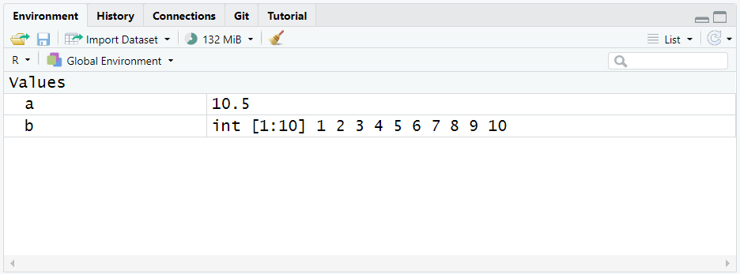
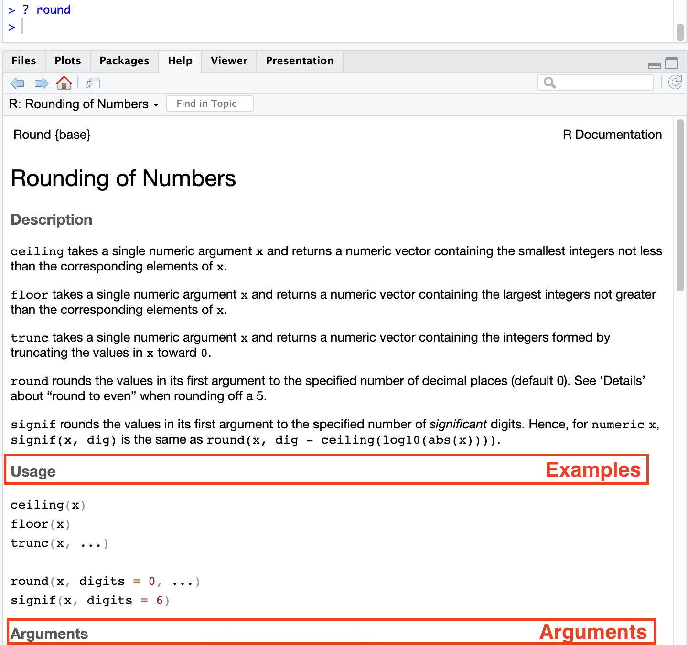

# First Concepts of R {.unnumbered}

## Variables

As seen in the introduction of programming with R we can perform several operations in the R scripts. Like the one below...

```{r}
#| code-line-numbers: false
10 + 3
```

But in most cases we will need to store values so we can re-use them later.

Imagine that we need to keep a value or the result of an operation, for doing that, we need to store them on the memory with an identifier... a **variable**.

For creating a a variable we need to define the name and then assign a value or object that will be stored on the variable using the `<-` syntax.

```         
<variable_name> <- <value>
```

Let's see it with an example...

```{r}
# We define variable 'a' that stores number 10
a <- 10
a
```

Then we can use the value stored on variable `a` and use them in more operations.

```{r}
# We increase by 3 and store the result on new variable 'b'
b <- a + 3
b
```

::: callout-tip
# Environment

Each time you create a variable or object it will appear on the *Environment* tab, so you can have control of all elements you have created.

{width="800"}
:::

::: callout-important
# Naming Variables

When naming variable take into account that it **cannot start by a number** and **cannot have special characters** such \@, **\$**, etc.
:::

Consider that the variables can be overwritten, so if you assign a new value to an existing variable their value will change.

```{r, echo=TRUE}
c <- 5
c
```

```{r, echo=TRUE}
c <- 20
c
```

You can control all existing variables and their content in the *Environment* tab on RStudio. But you can also check tipyng the `ls()` function on the console or your script it will return the existing variables in your environment.

```{r}
#| code-line-numbers: false
ls()
```


In the other hand, you would like to clean all variables at some point. You can use `rm(list=ls()))` command, to clean all variables. Being `rm()` the remove function and on the function we will provide the list of variables to delete. 

Clean variables is important when we are not going to use them anymore as it will free space in the memory of your computer allowing to be used for other processes and other variables. 

## Introduction to Functions

Functions are already created code programs we can use. They are pre-built and available on R and we can call them to perform quick operations, instead of creating the whole code. We have seen some examples in the variables section. 

The have a defined name and normally are followed by parenthesis `()`, inside the parenthesis we can include additional arguments to the function (inputs) that are needed to perform the operation we want to do (not all functions have arguments). The function will return the result. 

```r
<function_name>(<arguments_1>, <arguments_2>, ..., <arguments_n>)
```

R has different pre-defined functions we can use...

```{r, echo=TRUE}
# compute the mean from number 1 to 10
mean(1:10)

# we can combine functions
round(mean(1:10))
```

In the examples we have seen we have computed the mean of ten numbers, so the function `mean()` has one arguments we need to enter that is the numbers to use in the computation (we have provide with a range `1:10`). In the second case we have use the output to round it removing decimal numbers with `round()` function whose input arguments is the value to round. 

As we have seen functions can have multiple arguments, with a name each one. When providing arguments we can enter them by name or we can provide them without naming the arguments, in the second case we need to enter them on the same order they are expected to be included. We can check the order and the arguments in the function documentation. 

```{r, echo=TRUE}
# sample a number between 1 to 10
sample(x = 1:10, size = 1)

# we don't need to use the name if we follow the same order
sample(1:10, 1)
```

You can see the arguments of a function using `args()` function.

```{r, echo=TRUE}
#| code-line-numbers: false
args(sample)
```

Some arguments have a default value, so you don't need to provide one always. See `round()` function for example.

```{r, echo=TRUE}
#| code-line-numbers: false
args(round)
```

In the function `digits` have default value as 0, so if we do not provide a value for that argument the function will use the value 0. 

If you have doubts of about any function, its arguments or how it works you can use `?` command to see the official documentation. 

``` r
? round
```

This will show the documentation of the function in the *Help* tab of RStudio.



Here you have a summary of frequently used functions in R:


 Function   | Use                      |
|------------|--------------------------|
| `log()`    | computes the logarithm   |
| `exp()`    | computes the exponential |
| `min()`    | computes the min number  |
| `max()`    | computes the max number  |
| `sum()`    | computes the sum         |
| `mean()`   | computes the average     |
| `median()` | computes the median      |
| `var()`      | computes the variance                 |
| `sd()`       | computes the standard deviation       |
| `quantile()` | computes quantiles 0, 25, 50, 75, 100 |
| `cor()`      | computes de correlation               |