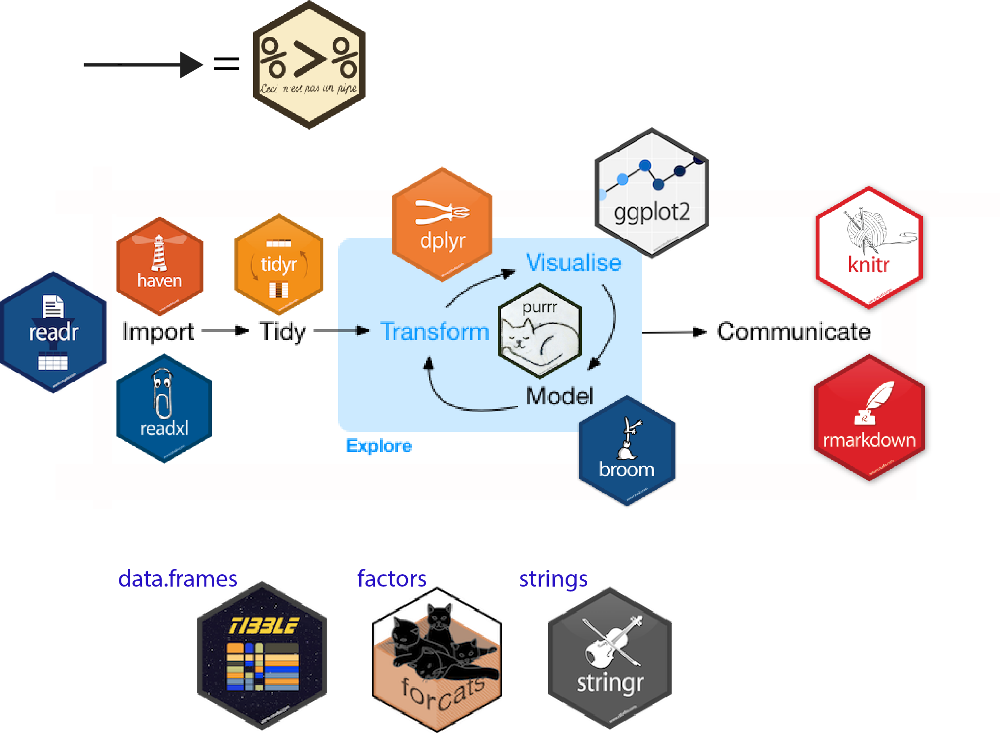

# Tidyverse {.unnumbered}

We have learn how to use R so far, and how to do some basic programming. Variables, data types, objects and key programming structures. In the next chapters of the course we are going to start to learn R as programming language for data analysis. 

We will understand data science and analytics with R, focused in two aspects...

-   Structured data (tables)

-   Descriptive and diagnostic analysis (exploration and inference)


For doing that the learning structure of the next chapters is structured as follows:

{style="width:900px"}

-   **Data Wrangling**
    1.  **Import**: Load data from different sources (databases, files, applications, etc.)
    2.  **Organize**: Save the data for the analysis.
    3.  **Transform**: Filter, create new variables, etc.
-   **Data Exploration**
    4.  **Visualization**: Think questions, create new variables, etc.
    5.  **Exploratory Analysis**: Visualize and transform in a systematic way.
-   **Modelling**
    6.  **Check hypothesis and answer questions**.
-   **Communication**
    7.  **Show the results**.
    
    
## The *tidyverse* ecosystem for data analysis

We want to analyze data in a **reproducible** way, and, for doing that we will use tools that can allow us develop strong analytics in R. Through the course we will use this set of packages that contains a full set of tools used for doing data science with R. Know more about [tidyverse packages](https://www.tidyverse.org/)


So we need to start loading  the **tidyverse** package (take into account that this package will load all tidyverse packages including tibble one). If you need to install tidyverse check the packages section on the first chapters of the book. 

```{r, message=FALSE}
library(tidyverse)
```
