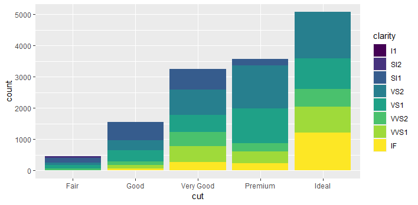
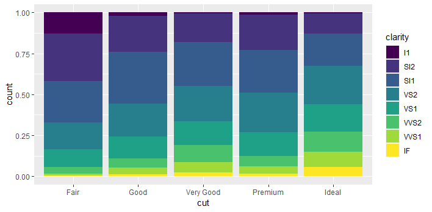
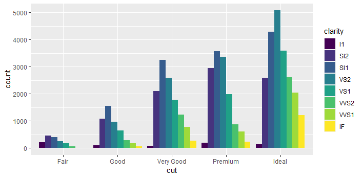
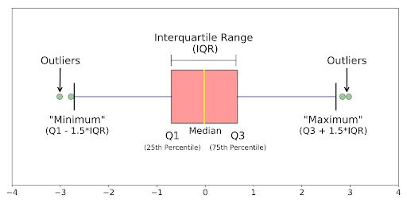

# Visualizing Different Data Types {.unnumbered}

When choosing the best way of analyze data we need to consider the number of variables we are working with:

- **Uni-variate Data Analysis**: Single variable distribution.

- **Bi-variate Data Analysis**: Relation between two variables.

- **Multi-variate Data Analysis**: Relation between different variables, normally focusing between two of them but conditioned by the rest.

And the type of the variables:

- **Numeric**: Data expressed on a numeric scale
  - *Continuous*: Can take any value in an interval (float, numeric)
  - *Discrete*: Can take only integer values, such counts.
- **Categorical**: Data expressed with an specific set of values or categories.
  - *Binary*: Special case when only two values are possible e.g. 1/0, true/false, yes/no, etc.
  - *Ordinal*: Categorical data that follows an explicit order
  - *Non-Ordinal*: Rest of categorical representations not covered in last groups.

::: callout-note
# Examples of variable types

Some examples...

- the height of a person is? - *NUMERIC & CONTINUOUS*
- the number of votes for each party is? - *NUMERIC & DISCRETE*
- the years of a person is? - *NUMERIC & DISCRETE*
- the color of the eyes is? - *CATEGORICAL & NON-ORDINAL*
- the size of a shirt is? - *CATEGORICAL & ORDINAL*
:::

## Uni-Variate Numeric Values

When working with uni-variate numeric values we need to consider the following key points to analyze:

- **Shape**: how the data is represented...

  - asymmetry: symmetric, asymmetric to the right, asymmetric to the left
  - mode: single mode, more than one mode, uniform.

- **Location or Centrality**: mean, median, mode

- **Variability or Dispersion**: rank, standard deviation, interquartile range

- **Outliers**: anomalies on the data

We are going to see it with an example using **Anscombe's Quartet** data available on `Tmisc` library. We are going to compute the statistics of the four data sets contained inside the quartet, this data sets have identical properties.

```{r, echo=TRUE, message=FALSE}
library(Tmisc) # loading Tmisc
library(tidyverse)

quartet %>%
  group_by(set) %>% # grouping the data by set
  summarise( 
    mean_x = mean(x), mean_y = mean(y),
    sd_x = sd(x), sd_y = sd(y),
    r = cor(x, y)
  ) # summarizing main stats
```

As you can see the four sets have the same properties for all key **Shape** metrics we have computed (mean, standard deviation and correlation). But it is true that they are equal? Seeing the results it is reasonable to think that, but we can confirm it visualizing the data...

```{r, echo=T}
ggplot(quartet, aes(x = x, y = y)) +
  geom_point() +
  facet_wrap(~ set, ncol = 4)
```

Now we have the whole picture, we can see that despite having equal properties in their metrics. Each data set is different in terms how the data is represented in the plots. That is why **is important to visualize the data and not only take assumptions based on the metrics.**

### Histograms

For analyzing visually the a single continuous numeric variable we normally rely on histograms. Histograms are a frequency plot, that show us the number of observations that have a value between a given range. Look at these example.

```{r, echo=TRUE, message=FALSE}
library(gapminder)

gapminder67 <- gapminder[gapminder$year == 1967, ]

ggplot(gapminder67, mapping = aes(x = gdpPercap)) + 
     geom_histogram(binwidth = 1000)
```

We can see the count (frequency) of observations in bar for each possible value of `gdpPercap`. This bars are called **bins**, you can manage how bins are generated using different ways...

- `binwidth`, number of values to consider en each bin. In the example we have defined the binwidth as 1000, means that it will show number of values in ranges of 1000, so the first bin is 0-999, second 1000 to 1999, on so on...
- `bins`, instead of defining the number of values to consider we define the number of bins we want ot have (number of bars). So ggplot will automatically compute the range to show the whole data in the number of bins we want.

```{r, echo=TRUE}
ggplot(gapminder67, mapping = aes(x = gdpPercap)) + 
     geom_histogram(bins = 100)
```

Going back to the plot, we can see that we have a bin with a value higher than 80000, a possible *outlier*? While the rest of observations are located between 0 a 30000.

### Density Plot

Another way of analyzing a single continuous numeric variable is using a density plot. It will show a similar shape as histograms, as it shows as the density (% of observations among total observations) for each possible values the variable can take.

```{r, echo=TRUE}
ggplot(gapminder67, mapping = aes(x = gdpPercap)) + 
     geom_density(color = "blue") + # density plot
     theme_bw()
```

What if we combine everything in a single plot. This way we can see both the histogram and the density plot. For doing that we use a *key word* called `..density..` on the `y` axis when defining the plot.

```{r, echo=TRUE, warning=FALSE}
ggplot(gapminder67, mapping = aes(x = gdpPercap, y =..density..)) + 
     geom_histogram(bins = 100, fill="grey") + 
     geom_density(color = "blue") + # density plot
     theme_bw()
```

## Uni-Variate Categorical Values

When we want to analyze a single categorical variable, we can follow a similar approach than with continuous, understand the frequency of observations for each category. In this case histograms don't work as we are working with a categorical value, so we need to use another kind of plots.

### Bar Plots

Bar plots are quick way to obtain the frequency of observations per category.

```{r, echo=TRUE}
ggplot(gapminder67, mapping = aes(x = continent)) + 
  geom_bar()
```

In the example we only provide the variable we want to have the count of, in this case as on `x` axis. You can do it on the `y` variable too. And the `geom_bar` will compute a `count` of observations. This is the default behavior of this geometry.

### Column Plot

Other option is to use a Column Plot, the difference with the Bar plot is that it allow us to be more flexible in what information we want to show. Here you can see the same plot as before but done with a column plot.

```{r, echo=TRUE}
gapminder67 %>% 
  group_by(continent) %>% 
  summarise(count = n()) %>% 
ggplot(gapminder67, mapping = aes(x = continent, y = count)) + 
  geom_col()
```

The main difference in the code, is that you need to prepare the data first and then make the plot. In the bar plot you can simply make the plot and the geometry will perform the data preparation. As a recap you can have the following table:

| Bar Plot `geom_bar` | Column Plot `geom_col` |
|-----------------------------------|-------------------------------------|
| Bar plot is used when we want to count the frequency of a single categorical variable (we can change the stat to do other operations) | Column plot can be used in all cases but needs data preparation before doing the plot. It allow us show much more complex metrics. |

### Position adjustment

Both Bar Plots and Column Plots allow us to make some adjustments to establish how the data is being displayed. All can be done using the **position** argument on the geometry.

``` r
ggplot(data = diamonds) +
geom_bar(mapping = aes(x = cut, fill = clarity), position="identity")
```

Argument options:

:::: {.columns}

::: column

{style="width:300px"}

{style="width:300px;"}

:::

::: column

{style="width:300px;"}

:::

::::

## Visualizing Bi-Variate Data

When we have a bi-variate data we need to understand which combination of data types we are working with. And most important in every case we want to understand if there is relation between them.

### Continuous - Categorical: BoxPlots

If we have a combination of continuous and categorical variables the most common way of analyzing their relation is using a Box Plot.

```{r, echo=T}
ggplot(gapminder67, mapping = aes(x = continent, y = gdpPercap)) +
  geom_boxplot()
```

Box plots are used to understand the distribution of numerical data. It shows the median, quartiles and possible outliers in a simple visual form. It is very interesting for comparing for each category the distribution of the data, so we can understand if each group behaves similarly of there are relevant differences between them. 

::: callout-info
# Reviewing Box Plots

Here you can see how much information a box plot is showing us:

{fig-align="center" width="423"}
:::

### Continuous - Continuous: ScatterPlot

When we are combining both continuous variables, it is interesting to analyze their relation and if there is any pattern. For doing that our first option is to use an scatter plot with `geom_point`:

```{r, echo=TRUE}
ggplot(gapminder67, aes(x = gdpPercap, y = lifeExp) ) +
  geom_point() +
  scale_x_log10() # We use the log scale to improve visualization
```

In this case we can see that looks there is a pattern, a positive relation. *A higher GDP per Capita is related with a higher life expectancy*. 

Other way to see if there is a relation in the data is to use a model geometry. We can try it with `geom_smooth` it will analyze if there is pattern between both variables and draw a model to explain it.

```{r, echo=TRUE}
ggplot(gapminder67, aes(x = gdpPercap, y = lifeExp) ) +
  geom_point() +
  scale_x_log10() +
  geom_smooth()
```

`geom_smooth` has analyzed the relation with both variables and generate model that tries to explain the relation. The blue line is the model and the faced area is the possible error on that model. As we can see it confirms the pattern we have seen showing the positive relation. 

### Categorical - Categorical

When we compare both categorical variables, we can use the same tools we have for single categorical value. In this case we will make deeper use of the **aesthetics** available on the `geom_bar`. 

We add `fill` aesthetic to include the second variable. This allow us to understand the frequency of elements for each category and number of elements in for each subcategory inside that category. 

```{r, echo=TRUE}
ggplot(data = diamonds, mapping = aes(x = clarity, fill = cut)) +
  geom_bar()
```

If we want to understand with more detail the subcategory we can change the representation with a proportion view using `position = fill`. This will help us understand the relevance of each subcategory in each category. 


```{r, echo=TRUE}
ggplot(data = diamonds, mapping = aes(x = clarity, fill = cut)) +
  geom_bar(position = "fill") +
  labs(y = "proportion")
```


## Statistical Transformations

Bar plots, Histograms or Density plots are an example of statistical transformations. This geometries are used for computed pre-defined analysis, what they do is compute make transformations of the data prior to their representation:

- Bar plots and Histograms: cluster the data and represent a number for each cluster.

- Smoothers: adjust the model and represent predictions generate by the same model.

- Box plots: calculate a summary of the distribution and show it in a determine format.

The argument we use for telling the geometric which method to use is **stat** you can see it using `? geom_bar` documentation.

In addition you can create your custom visual with stats...

You can create your own stats. For example we want to create a visual that show us the minimun, maximun and median of each category...

```{r, echo=TRUE}
ggplot(data = diamonds) +
  stat_summary(
    mapping = aes(x = cut, y = depth),
    fun.min = min,
    fun.max = max,
    fun = median
    )
```

## Last tips: Communication 

Try to adapt your plots to the message you want to share and to the final customer, after all if they don't understand quickly what you are showing they will loose interest. 

Be practical and simple, depending on the context: 

* technical or scientific (probably you can be more complex), 

* executive review (be simple and make the visualization that shows the message you want to tell)

Recommended further reading... [StorytellingWithData](https://www.storytellingwithdata.com/), to create simple and powerful plots to your executive presentations. 
