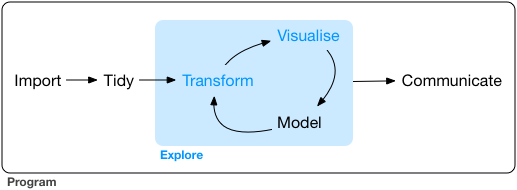

# Transformation {.unnumbered}

Transformation is one of the key tasks for the correct use of the data, but is very rare to find the data fully ready for an analysis, so we probabluy need to do some tasks to adapt it for the analysis we want to do.

{fig-align="center" width="402"}

Generally we will need...

-   Create new variables

-   Sum up some of them.

-   Rename variables

-   Reorder

-   Grouping

... among other things.

## Transformation: **dplyr**

We will use an special package designed inside the *tidyverse* universe for this purpose... **dplyr**

This package has his own language (verbs) for doing the different tasks of the transformation process...

* Working with rows...
  -   **arrange** to order rows
  -   **slice** to subset rows
  -   **filter** to select rows according to a certain condition

* Working with columns...
  -   **select** to choose columns
  -   **rename** to rename columns
  -   **mutate** to create new columns
  
* And other much more...

## Basic *dplyr* rules

All verbs work similar:

-   first argument is the data frame
-   second and subsequent arguments are used to specify what to do with the data frame
-   each verb will return a new data frame modified

All verbs can be **concatenated** using the pipe `%>%`

For starting working with **dplyr** we will need to load it...

```{r}
#| eval: false
#| code-line-numbers: false
library(tidyverse)  # Do library(dplyr) for the package only
```
