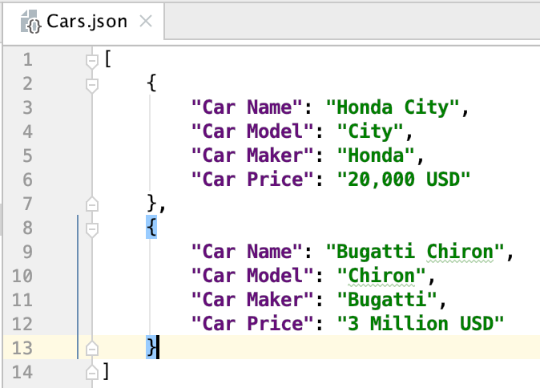
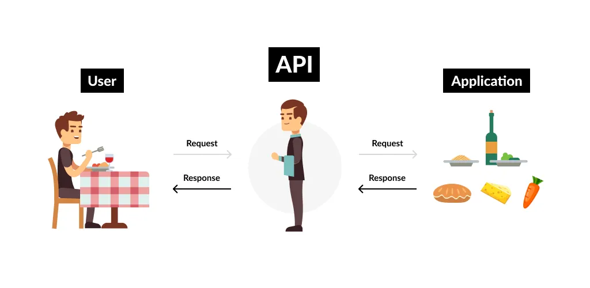

# Other Files {.unnumbered}

```{r, echo=FALSE, message=FALSE}
#| code-line-numbers: false
library(tidyverse)
```

There are plenty of libraries useful for reading/writing from different kind of sources in R:

- **haven** for SPSS, Stata, SAS
- **readxl** and **writexl** for reading and writing excel files
- **DBI** together with **RMySQL** or **RSQLite** for launching SQL queries to databases.
- **jsonlite** for JSON

## Reading JSON data

### What is JSON?

- JSON are the letters of Javascript Object Notation, is a lighter storing data format.

- It is very frequently used for APIs, data is stored using objects pair key-value.

{width="292"}

For working with JSON in R we need to use `jsonlite` library.

```{r, echo=TRUE, eval=FALSE}
library(jsonlite)

# Reading JSON
iris_df <- read_json("data/iris.json", simplifyVector = TRUE)

head(iris_df)
```

## Reading from APIs

### What is an API

An application programming interface (API) is a set of defined rules that explain how computers or applications communicate with one another. In this section will learn how to use these tools for requesting data from a web server (get method).

They can also be used for submitting forms (post method) or any interaction that the user can be allowed to —delete, put, etc.

### How it works

{fig-align="center"}

1.  User or computer asks to the API following a pre-defined syntax. Normally this petitions are done with an URL following a defined structure.

2.  The API receives and verifies the petition and translates this petition to the corresponding system or database to retrieve and send the answer to the user.

3.  User receives the answer.

This way the system or database is protected and the access is controlled via the API, that verifies and manages petitions.

### Using APIs with R: `httr2`

In R we are going to use `tidyverse` library called `httr2` that will help us using APIs.

```{r, echo=TRUE, message=FALSE}
#| code-line-numbers: false
library(httr2)
```

{fig-align="left" width="92" height="88"}

## API Example

We are goint to work with the Instituto Nacional de Estadística (INE) API for retrieving information.

The portal has an API where we can obtain data [here](https://www.ine.es/dyngs/DataLab/es/manual.html?cid=45).

A normal URL for making request to the API has the following format...

*https://servicios.ine.es/wstempus/js/{idioma}/{función}/{input}\[?parámetros\]*

### Obtaining data from PCI-IPC

We want to obtain information regarding Consumer Prices Index (PCI-IPC) evolution in Spain for different groups.

For these we will need to manage how to implement the URL and make the request. You can use in these case an URL generator [here](https://www.ine.es/dyngs/DataLab/manual.html?cid=66)

```{r, echo=T, message=T}
# Create basic request (by default is a GET, we can change it)
req <- request("https://servicios.ine.es/wstempus/js/ES/DATOS_TABLA/50903?date=20240101:20240630")
req
```

### Perfoming requests

Once we have configured the request, we can perform it...

```{r,echo=T, message=T}
resp <- req_perform(req)
resp
```

### Responses Components: Status

If all goes correct we will receive a 200 response code (OK)

```{r,echo=T, message=T}
resp_status(resp)
resp_status_desc(resp)
```

But something can go wrong... in that cases...

- 404 - File not found

- 403 - Permission denied.

- 500 - Generic failure.

### Responses Components: Headers

```{r,echo=T, message=T}
#| code-line-numbers: false
resp_headers(resp)
```

### Responses Components: Body

Your requested data will be in the response body, we will obtain this information using JSON format...

```{r,echo=T, message=T}
body_resp <- resp_body_json(resp)

result_data <- body_resp[[1]]$Data
result_data[[1]]
```

### Obtaining the data

We can extract and prepare the data...

```{r,echo=T, message=T}
ipc_data <- as_tibble(
  list(
    "year" = c(2024),
    "month" = c(0),
    "value" = c(0)
  )
) %>% filter(month != 0)

for (res in result_data){
  temp_data <- as_tibble(
    list(
      "year" = c(res$Anyo[1]),
      "month" = c(res$FK_Period[1]),
      "value" = c(res$Valor[1])
    )
  )
  ipc_data <- rbind(ipc_data,temp_data)
}

ipc_data
```

## Other cool APIs you can try!!

- https://medium.com/@diego.coder/las-mejores-apis-públicas-para-practicar-programación-a7419ecc968e

- https://www.thecocktaildb.com

- Transport of London API. You can read and try the TFL_Api_Example.R file and see how it works.
