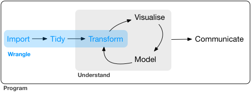

# Reading {.unnumbered}

## Data Wrangling

**Objective**: Make data ready for their future **exploration** and **modelling**

We need to convert **raw data** into **processed data**

### Raw Data

- Data as it appears on the source origin.
- Any manipulation has been done to them.

### Processed Data

- Each variable in a column.
- Each observation in a raw.
- Each observational unit is a cell.
- More complex data, interconnected tables.

The process work as follows...

1.  Importing the data
2.  Organizing the data
3.  Transforming the data

{fig-align="center" width="426"}

## Importing data

We will learn how to import, download and read data in R. Mainly focused on **tabular** data.

As we have seen we will continue using the **tidyverse** ecosystem, focused on the main packages available for importing data into our environments.

```{r, echo=TRUE}
#| eval: false
#| code-line-numbers: false
library(tidyverse)
```

We will follow this schema...

- Download data
- Read and Write data with tidyverse packages
