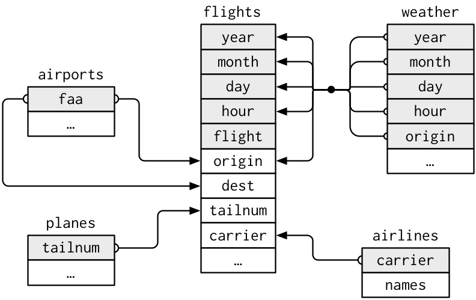
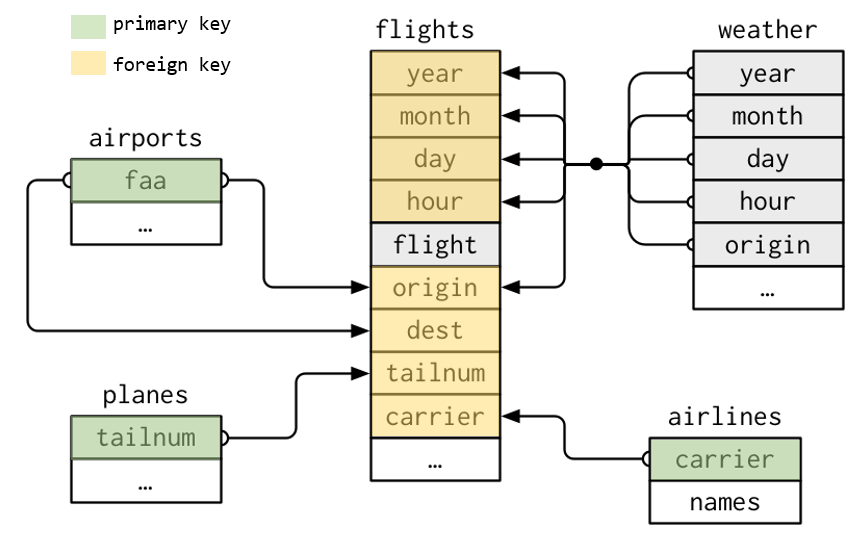
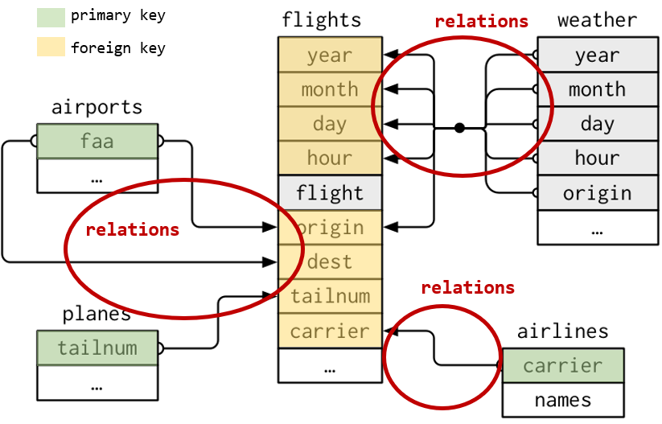
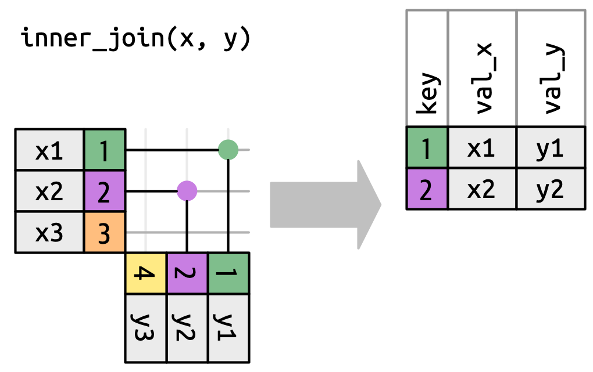
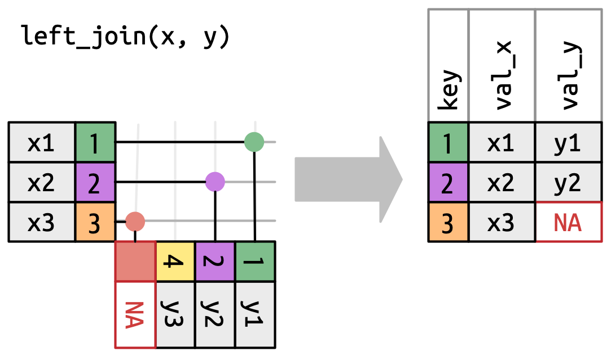
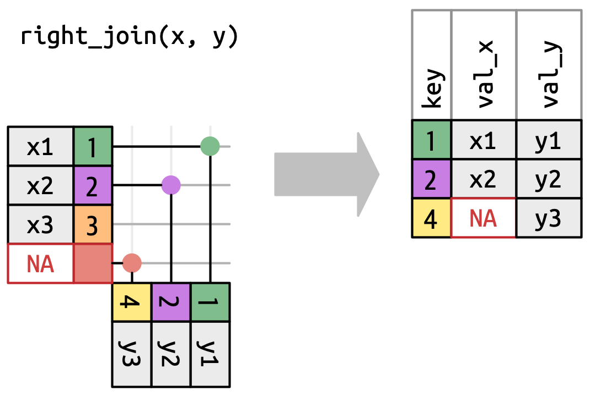
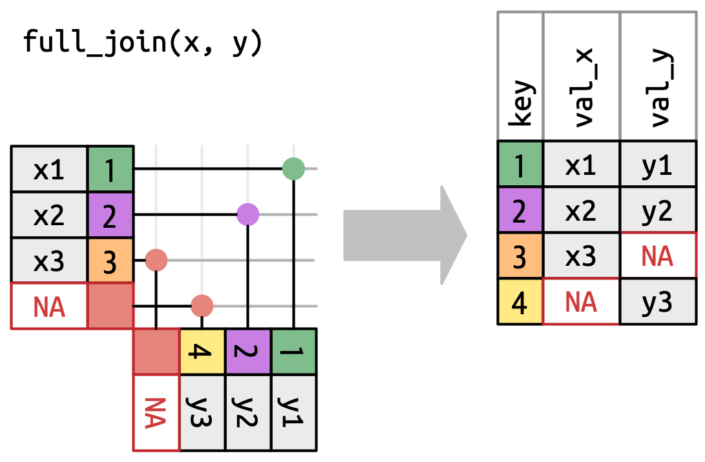
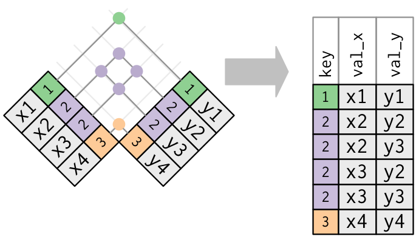
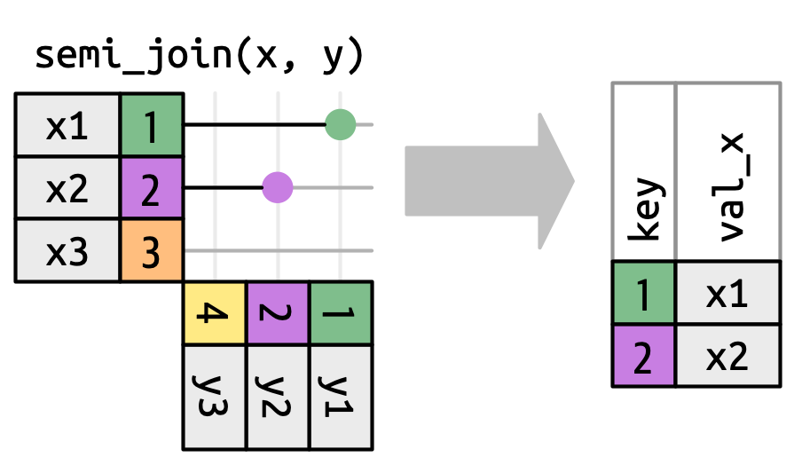
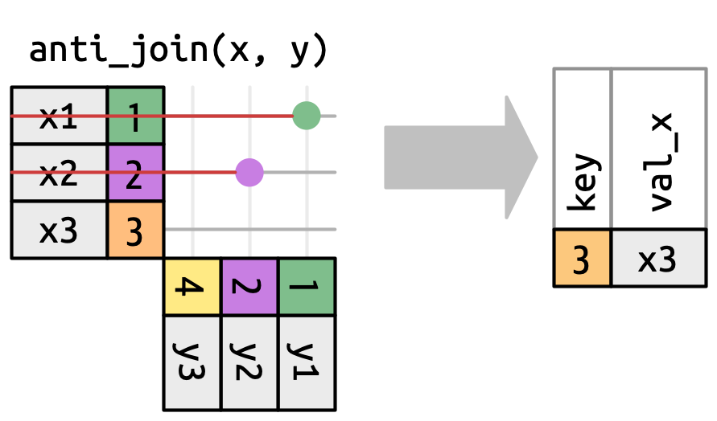

# Relational Data {.unnumbered}

```{r, echo=FALSE, message=FALSE}
#| code-line-numbers: false
library(tidyverse)
```

When working with data we will normally need more than one database, different tables. This makes more richer the analysis, as we cross different sources of data to increase the information available.

We need to know how to join different data tables. When the data is distributed in different tables we speak about **relational data**.

Inside **tidyr** we can find the following type of joins...

- **Mutating Joins** Designed to join data from another table.

- **Filtering Joins** Designed to filter data using the another table data as reference if they match or not rows.

- **Set operations** Use observations from different tables to make full set comparisons.

## Database concepts

For the full explanation we will use the following database called *nycflights13*:

- **airlines**, names of different airlines.
- **airports**, information of each airport.
- **planes**, information of each plane.
- **weather**, weather information of each airport of NYC in every hour.
- **flights**, information about each flight that depart from NYC in 2013

```{r, echo=TRUE, message=FALSE}
#| code-line-numbers: false
library(nycflights13)
```

{fig-align="center" width="410"}

### Keys

**Variables** used for connecting within different tables. They make helpful identifying observations inside the tables and make then differentiate from other observations.

Two kind of keys:

- **Primary Key** Used for identifying an observation from the rest in a table.

- **Foreign Key** Used for identifying an observation in another table in relation with other table.

A Foreign key should be associated to a Primary key from another table.

{fig-align="center" width="455"}

Once detected the keys, is easy to check if we have identify them correctly.

```{r, echo=TRUE}
planes %>% 
  count(tailnum) %>% 
  filter(n > 1)

weather %>% 
  count(year, month, day, hour, origin) %>% 
  filter(n > 1)
```

::: callout-tip
# Create your own key

It is possible to find tables without a clear defined key or any combination of fields that allow us using them as keys (weather of flights tables are examples of that)

In these cases we can easily create our own key using row indexes.

```{r, echo=TRUE}
#| code-line-numbers: false
flights_key <- flights %>% mutate(key = row_number())
```

```{r, echo=TRUE}
flights_key %>% 
  count(key) %>% 
  filter(n > 1)
```
:::

### Relationships between tables

Between a *primary key* and a *foreign key*, tables form **relationships**.

Generally, relationships will be one to many... e.g. *each flight has only one plane, but a single plane can do multiple flights*

But we can also find situations where one to one or many to many relationships are being used.

{fig-align="center" width="467"}

## Mutating Joins

We use them to combine variables between two tables.

First it will pair the observations of both tables using the corresponding keys, then it will add the the different variables from one table to another.

For understanding the different join concepts we will work with this synthetic data example.

```{r, echo=TRUE}
x <- tibble(
  key = c(1,2,3),
  val_x = c("x1", "x2", "x3")
)

y <- tibble(
  key = c(1,2,4),
  val_y = c("y1", "y2", "y3")
)
```

{fig-align="center" width="176"}

### Inner Join

Inner join will pair those observations that match between both tables. Otherwise they won't be joined and won't appear on the result table.

{fig-align="center" width="274"}

```{r, echo=TRUE}
x %>% 
  inner_join(y, by = "key")
```

### The `by` argument

As we have seen `by` parameter in join functions help us identifying the key to use for joining data. This argument is used in all functions we are going to see and it is key to do a proper join of relational data.

### Case 1. Default value

If we don't tell the function a variable to use, it will have its default value... `by = NULL`. In this case it will use all the variables that appear in both tables as key.

*What will happen in this example?*

```{r, echo=TRUE, eval=FALSE}
flights %>% 
  inner_join(weather) %>% 
  head(5)
```

As you can see in the output message if we do not provide a `by` argument the join function will try to guess the columns to use. This is done by similar name and data type.

### Case 2. Common variable(s)

As we have seen, we can tell the function the common variable to use as key... `by = "x"`. Is important to remark the the variable name is common in both tables.

```{r, echo=TRUE, eval=FALSE}
flights %>% 
  inner_join(planes, by = "tailnum") %>% 
  head(5)
```

In case we need to use more than one variable as key we can tell the function using a vector... `by = c("x", "y")`. It will join using both variables.

```{r, echo=TRUE, eval=FALSE}
flights %>% 
  left_join(planes, 
            by = c("year", "month", "day", "hour", "origin")
            ) %>% 
  head(5)
```

### Case 3. Different variable(s)

In this case both tables have a variable in common but named differently... `by = c("a" = "b")`, this way the join will use key **a** of the right table with key **b** of the left table to make the matching.

```{r, echo=TRUE, eval=FALSE}
flights %>% 
  left_join(airports, by = c("dest" = "faa")) %>% 
  head(5)
```

### Outer joins

Outer joins are designed to conserve observations that appear **at least** in one of the data sets (tables).

- **Left join**. Conserve all observations from **x**
- **Right join**. Conserve all observations from **y**
- **Full join**. Conserve all observations from **x** and **y**

#### Left Join

Left join will return all observations from the left table (**x**) and those from right table (**y**) matching an observation from x. Observations from **x** without match will have filled as `NA` the variables from **y**

{fig-align="center" width="274"}

```{r, echo=TRUE}
x %>% 
  left_join(y, by = "key")
```

#### Right Join

Right join will return all observations from the right table (**y**) and those from left table (**x**) matching an observation from y. Observations from **y** without match will have filled as `NA` the variables from **x**

{fig-align="center" width="274"}

```{r, echo=TRUE}
x %>% 
  right_join(y, by = "key")
```

#### Full Join

Full join will return all observations from the left table (**x**) and from right table (**y**). Observations from **x** or **y** without match in the other table will have the variables from the other table filled as `NA`.

{fig-align="center" width="274"}

```{r, echo=TRUE}
x %>% 
  full_join(y, by = "key")
```

### Duplicated Values

Duplicated values may occur when where joining tables that have another type of relationships different to **one-to-one**, in these cases we can found...

- **one-to-many** relationships, where in one table we can found duplicated keys.

- **many-to-many** relationships, where in both tables we can found duplicated keys.

#### Duplicated Values: One-to-many

In this case we have two tables, and in one of them we have duplicated values. The duplication found in one of the tables will result on duplication in the final output, duplicating the other table registers too.

{fig-align="center" width="274"}

```{r, echo=TRUE}
x <- tibble(
  key = c(1,2,2,1),
  val_x = c("x1", "x2", "x3", "x4")
)

y <- tibble(
  key = c(1,2),
  val_y = c("y1", "y2")
)

left_join(x, y, by ="key")
```

#### Duplicated Values: Many-to-many

This is the worst case, as we have duplicates in both tables. The final output will be a cartesian product, duplicating all rows as all possible combinations exist of duplicated registers.

{fig-align="center" width="274"}

A warning message is returned by the function...

```         
Warning in left_join(x, y, by = "key"): Detected an unexpected many-to-many relationship between `x` and `y`.
ℹ Row 2 of `x` matches multiple rows in `y`.
ℹ Row 2 of `y` matches multiple rows in `x`.
ℹ If a many-to-many relationship is expected, set `relationship =
  "many-to-many"` to silence this warning.
```

```{r, echo=TRUE}
x <- tibble(
  key = c(1,2,2,3),
  val_x = c("x1", "x2", "x3", "x4")
)

y <- tibble(
  key = c(1,2,2,3),
  val_y = c("y1", "y2", "y3", "y4")
)

left_join(x, y, by ="key")
```

## Filtering Joins

As mutating joins allow us to include new variables and more information to our data set, filtering joins help us filtering observations in our data set following the observations existing in another table. We can find two kinds of filtering joins...

- **semi_join**
- **anti_join**

### Semi Join

Semi join (`semi_join(x, y)`) will maintain all observations existing on **x** table that **have a match** in **y** table.

{fig-align="center" width="274"}

```{r}
x <- tibble(
  key = c(1,2,3),
  val_x = c("x1", "x2", "x3")
)

y <- tibble(
  key = c(1,2,4),
  val_y = c("y1", "y2", "y3")
)
```

```{r, echo=TRUE}
x %>% 
  semi_join(y, by = "key")
```

### Anti Join

Anti join (`anti_join(x, y)`) will maintain all observations existing on **x** table that **don't have a match** in **y** table.

{fig-align="center" width="274"}

```{r}
x <- tibble(
  key = c(1,2,3),
  val_x = c("x1", "x2", "x3")
)

y <- tibble(
  key = c(1,2,4),
  val_y = c("y1", "y2", "y3")
)
```

```{r, echo=TRUE}
x %>% 
  anti_join(y, by = "key")
```

## Set Operations

This functions are used to work with two tables. They expect both tables have the **same** variables, as they will play with them as sets, comparing all variables for each observation...

- `intersect(x, y)` it returns the observations that exist in both tables.

- `union(x, y)` it returns all unique observations existing in both tables. There is a `union_all(x, y)` that will show all (in case of similar in both tables they will appear repeated)

- `setdiff(x, y)` it returns the observations existing in **x** but not in **y**

We can see some examples using the following data...

```{r, echo=TRUE}
df1 <- tibble(x = c(1,2), y = c(1,1))
df2 <- tibble(x = c(1,1), y = c(1,2))
```

```{r, echo=TRUE}
intersect(df1, df2)
```

```{r, echo=TRUE}
union(df1, df2)
```

```{r, echo=TRUE}
setdiff(df1, df2)
```
