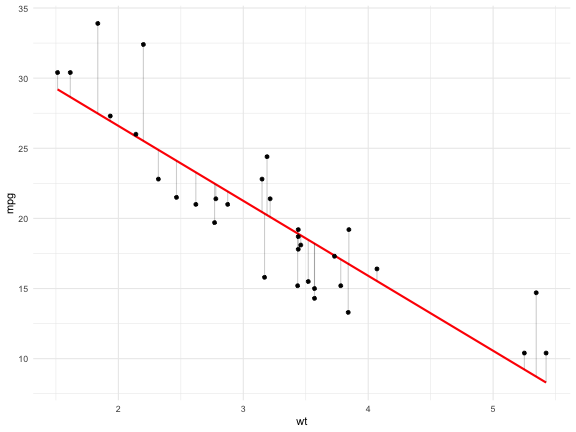

# Models {.unnumbered}

```{r, echo=FALSE, message=FALSE, warning=FALSE}
library(tidyverse)
```

## Basic concepts

As we have seen in the introduction models are tools that help us find patterns in the data. 

We will study models that relate a group of variables (prediction variables) with a variable we are interested in (answer variable)

Models will represent these relations with **functions**. This functions will map a series of inputs to an output, we can express the function as:

$$
y = 3x + 7
$$
*Where $x$ is the input and $y$ the output.* 

## What are models?

Here you can see an example of a model shown in a plot. That explains the relation between two variables weight of the car (`wt`) and miles per gallon (`mpg`) using the `mtcars` data set. 

```{r, echo=TRUE, message=FALSE}
#| code-line-numbers: "6"

library(ggplot2)
ggplot(mtcars, aes(x=wt, y=mpg)) +
  geom_point() +
  theme_minimal() +
  geom_smooth(method="lm", se=FALSE, color="red")
```

## Family of models and models

When we speak about models we need to understand two different things...

* **Family of models** General designed models that define a pattern we want to capture. E.g. the family of linear models that relate $x$ with $y$ is...

$$
y = \beta_0 + \beta_1x
$$

* **Fitted model** the model inside the family that betters reproduce and captures the existing relation within the data. 

Remember models are simplifications of reality, but do not necessary express the reality. They help us summary the patterns and reproduce them. 

So when we need to use a model we decide the **family** we want to use. Once selected the family we will apply that model (like a template) to the data we want to explain. The final model that is able to explain the relation will be de **fitted model**.

When we see the structure of a model we need to understand three concepts:

* **Response variable**: Variable we want to analyze and understand, the behavior and variation. It is also known as dependable variable. Normally we will drawn this variable in y axis. 

* **Explainable variables**: Variables we want to use to explain the response variable behavior. Also known as independent variables, co-variables, predictors or *features*. We will normally drawn them on the x axis. 

* **Predicted variable**: the output of our model for certain value of the explainable variables. 

## Fitting models

Look at the following data... do you see any pattern? detect the variables?

```{r, echo=TRUE}
ggplot(mtcars, aes(x=wt, y=mpg)) + 
  geom_point() + theme_minimal()
```

* The data shows a clear pattern. 

* We will use a model to try to capture the pattern. 

* A linear model seems reasonable: $y = \beta_0 + \beta_1x$

* But linear models is a big family of models, infinite models can exist.

When creating a model we have multiple possibilities...

All possible models, or at least some of them...

```{r, echo=TRUE}
models <- tibble(
a1 = runif(250, -20, 40),
a2 = runif(250, -5, 5)
)

ggplot(mtcars, aes(wt, mpg)) +
  geom_abline(aes(intercept = a1, 
                  slope = a2), 
              data = models, alpha = 1/4) +
  geom_point() + theme_minimal()
```

* As you can see these models are **bad**, didn't capture the pattern. 

* We will need to determine which models are **more close** to the data.

One common approximation is to find the model that minimizes the sum of all vertical distances to each point of the straight line of the model.



This is what we know as **Linear Regression**. 