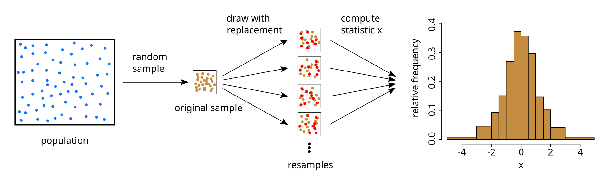
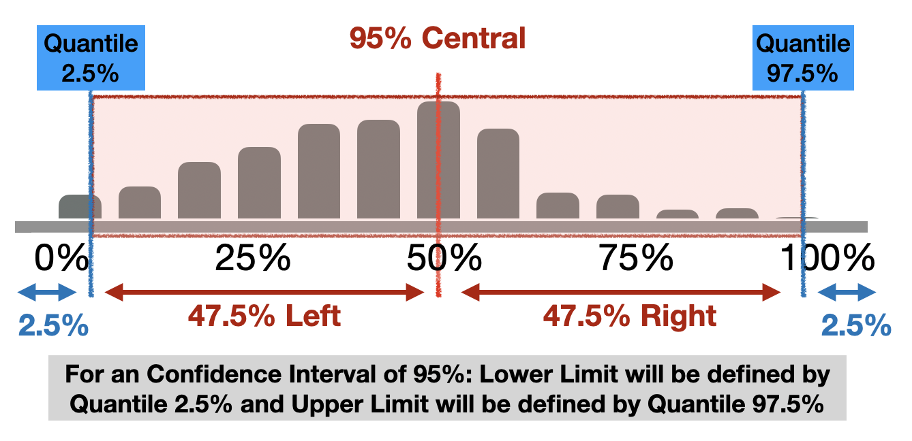

# Inference {.unnumbered}

```{r, echo=FALSE, message=FALSE, warning=FALSE}
library(tidyverse)
```


We need to understand some concepts first...

* **Population**: Group of elements to study
* **Parameter**: Numeric amount originated from the population, normally unknown. 

If we have data about each element of the **population** we could calculate the population **parameter**. 

But this is not possible in most of the cases. For this reason we work with...

* **Sample**: A subset of our population of interest.
* **Statistic**: Numeric amount originated from the sample. 

If the **sample** represents correctly the population we could use probability and statistical inference to obtain conclusions applicable to the whole population. 

## Statistical Inference

**Statistical Inference** is the process that allows, through data, obtain conclusions and apply them to the whole population where the sample was originated. 

* **Estimation**, use the sample to estimate a possible interval of values for a given population parameter unknown. 

* **Hypothesis Contrast**, evaluate if the given sample shows an evidence of the application of a given affirmation about the population.

We will work with **estimation** here. 

For the rest of this chapter we will work with a sample data to help us explain the concepts and a case: **Average price of an Airbnb in València**

We have obtained the data from València Airbnb prices thanks to [Inside Airbnb](https://insideairbnb.com/valencia/) data repository that scrapped all listings from the website on the 22nd of June 2024. 

**Population for the analysis:** All airbnb' houses/apartments  with at least 10 reviews in València. 

**Goal Paremeter:** Average price per night in those airbnbs.

Which is the average price for an airbnb with at leat 8 reviews in the city of Valéncia at the month of June? 

We are going to use a random sample data with 50 airbnb locations with the price per night value informed.

## Point Estimation

A **point estimator** is a value computed from the sample to serve as the "best estimation" for the population parameter. 

Our point estimator for the average price per night will be the average obtained from the sample:

```{r, echo=TRUE, message=FALSE}
data <- read_csv("data/vlc_listings_50.csv")
data %>% 
  summarise(mean_price = mean(price))
```

Now we can see our point estimator and the sample represented with an histogram

```{r}
ggplot(data) +
  geom_histogram(aes(x=price),bins=10,fill="lightgrey",color="black") +
  geom_vline(xintercept = 137.98, color="red") +
  geom_text(x=150, y = 15, label = "137.9", size = 4) +
  ggtitle("AirBnB price distribution for June 2024 in València") +
  theme_minimal()
```

Point estimators are useful when we are trying to find a general value to define a parameter, but they can be not representative and highly affected by the distribution of the sample values. We can provide a range of values where the parameter can be found. 

* If we provide only a single value (point estimation), we can fail trying to find the exact parameter for the population.

* If we provide a range of values, we have more probabilities of having the parameter inside the range of values we found. 

## Confidence Intervals

For building a confidence interval for the population parameter, we need to create a rank of possible values around the observed sample's average. 

It is important to note that the random samples, will be different between them. This means if we take a another random sample of more 50 listings about AirBnb in València, it is possible not to obtain the same price average. 

**There is a variability in the sample average.**

For building a confidence interval, we need to measure this variability. This will give us on how much we can expect our sample average to variate from each sample. 

:::: .calloit-caution
Ex 1: We divide the class in two groups and we ask each student their height. Then we compute the average height for each group. Will you expect them to be the same, similar or different?

Ex 2: We take 50 students randomly and looks 5 of them write with the left hand. If you take another random sample of 50 students. How many of them will you expect to be left-handed? Will you be surprised if only 3 of them are left-handed? And if they were 40 this time?
::::

### How to measure variability?

We can measure variability of the sample values with different approaches:

* **Simulation**: we can use re-sampling techniques or "bootstrap" to find different values for the same metric. 

* **Theory**: using the Central Limit Theorem (Normal Distribution)


## Bootstrap

**Bootstrap** is a re-sample technique used for measuring the variance of an estimation. 

We will use it for estimating the population parameter using only the given sample. 

It uses the same principles of the statistical inference so it is considered an alternative. 




###  Bootstrap Procedure

1. Take a **bootstrap sample**, a random sample **with replacement** from the original sample, **with the same size** of the original sample. 

2. Compute the **bootstrap statistic**: the statistic we want to compute (average, median, correlation, ...) using the bootstrap sample. 

3. Repeat steps 1 and 2 multiple times to create a **bootstrap distribution** - a distribution of bootstrap statistics. 

4. Compute the confidence interval limits of XX% as the region that has the XX% of the bootstrap distribution. 

#### Step by step
 
**Step 1.** Take a **bootstrap sample**, a random sample **with replacement** from the original sample, **with the same size** of the original sample. 

```{r, message=FALSE}
set.seed(1)
indices <- sample(1:nrow(data), 50, replace = T)
boot_samp_1 <- data %>% 
  select(price) %>% 
  slice(indices)
```

```{r, message=FALSE}
ggplot(boot_samp_1) +
  geom_histogram(aes(x=price),bins=10,fill="lightgrey",color="black") +
  theme_minimal()

```


**Step 2.** Compute the **bootstrap statistic**: the statistic we want to compute (the average price in this case) using the bootstrap sample.

```{r}
mean1 <- round(mean(boot_samp_1$price), 2)
ggplot(boot_samp_1) +
  geom_histogram(aes(x=price),bins=10,fill="lightgrey",color="black") +
  geom_vline(xintercept = mean1, color="red") +
  geom_text(x=150, y = 15, label = mean1, size = 4) +
  theme_minimal()

```

 
**Step 3.** Repeat steps 1 and 2 multiple times to create a **bootstrap distribution**

```{r, echo = F, message=FALSE}
set.seed(1)
temp <- data %>% slice(sample(1:50, replace = T))
mean1 <- round(mean(temp$price), 2)
p1 <- ggplot(temp) +
  geom_histogram(aes(x=price),bins=10,fill="lightgrey",color="black") +
  geom_vline(xintercept = mean1, color="red") +
  geom_text(x=150, y = 15, label = mean1, size = 4) +
  theme_minimal()
```

```{r, echo = F, message=FALSE}
set.seed(2)
temp <- data %>% slice(sample(1:50, replace = T))
mean1 <- round(mean(temp$price), 2)
p2 <- ggplot(temp) +
  geom_histogram(aes(x=price),bins=10,fill="lightgrey",color="black") +
  geom_vline(xintercept = mean1, color="red") +
  geom_text(x=150, y = 15, label = mean1, size = 4) +
  theme_minimal()
```

```{r, echo = F, message=FALSE}
set.seed(3)
temp <- data %>% slice(sample(1:50, replace = T))
mean1 <- round(mean(temp$price), 2)
p3 <- ggplot(temp) +
  geom_histogram(aes(x=price),bins=10,fill="lightgrey",color="black") +
  geom_vline(xintercept = mean1, color="red") +
  geom_text(x=150, y = 15, label = mean1, size = 4) +
  theme_minimal()
```

```{r, echo = F, message=FALSE}
set.seed(4)
temp <- data %>% slice(sample(1:50, replace = T))
mean1 <- round(mean(temp$price), 2)
p4 <- ggplot(temp) +
  geom_histogram(aes(x=price),bins=10,fill="lightgrey",color="black") +
  geom_vline(xintercept = mean1, color="red") +
  geom_text(x=150, y = 15, label = mean1, size = 4) +
  theme_minimal()
```

```{r, echo=F, message=FALSE}
 ggpubr::ggarrange(p1, p2, p3, p4)
```

In this case we have make 500 bootstrap re-samples and then compute the average for each one. What we do finally is represent all the averages in an histogram plot:

```{r, echo = F, out.width = "70%", message=FALSE, warning=FALSE}
boot_dist <- tibble(boot_mean = numeric(500))
for(i in 1:500){
  set.seed(i)
  indices <- sample(1:50, replace = T)
  boot_dist$boot_mean[i] <- mean(data$price[indices])
}
ggplot(data = boot_dist, aes(boot_mean)) +
  geom_histogram(binwidth = 5, color = "darkred", fill = "pink") +
  labs(x = "", y = "", title = "Bootstrap distribution of sample means") +
  scale_x_continuous(breaks = seq(0, 250, by = 50)) + 
  xlim(0, 250) +
  theme_minimal()
```

Here we can compare the original sample and the distribution of bootstrap means. 

```{r, echo=F, message=FALSE, warning=FALSE}
p1 <- ggplot(data) +
  geom_histogram(aes(x=price),bins=10,fill="lightgrey",color="black") +
  geom_vline(xintercept = 137.98, color="red") +
  geom_text(x=150, y = 15, label = "137.9", size = 4)+
  ggtitle("Original Sample") +
  scale_x_continuous(breaks = seq(0, 450, by = 50)) + 
  xlim(0, 450) +
  theme_minimal()
```

```{r, message=FALSE, warning=FALSE}
#| echo: false

boot_dist <- data.frame(boot_mean = numeric(500))
for(i in 1:500){
  set.seed(i)
  indices <- sample(1:50, replace = T)
  boot_dist$boot_mean[i] <- mean(data$price[indices])
}

boot_plot <- boot_dist
p2 <- ggplot(data = boot_dist, aes(boot_mean)) +
  geom_histogram(binwidth = 5, color = "darkred", fill = "pink") +
  labs(x = "", y = "", title = "Bootstrap distribution of sample means") +
  scale_x_continuous(breaks = seq(0, 450, by = 50)) + 
  xlim(0, 450) +
  theme_minimal()

ojs_define(boot_plot = boot_plot)
```

```{r, echo=FALSE, message=FALSE, warning=FALSE}
 ggpubr::ggarrange(p1, p2, ncol=1, nrow=2)
```


**Step 4.** Compute the limits of the bootstrap interval using the percentiles of the bootstrap distribution. 

```{ojs, echo=FALSE, message=FALSE}
//| panel: sidebar
//| echo: false
d3 = require("d3@7")

viewof confidence = Inputs.range(
  [0, 100], 
  {value: 95, step: 1, label: "Confidence%:"}
)

lowerBound = d3.quantile(boot_plot.boot_mean,(1-confidence/100)/2)

upperBound = d3.quantile(boot_plot.boot_mean,confidence/100+(1-confidence/100)/2)


```

```{ojs, echo=FALSE, message=FALSE}
//| panel: fill
//| echo: false

Plot.plot({
  y: {
    grid: true
  },
  marks: [
    Plot.rectY(
      boot_plot.boot_mean,
      Plot.binX(
        { 
          y: "count"
        },{
        fill: "#ffdad8",
        
        }
      )
    ),
      Plot.ruleX([lowerBound]),
      Plot.ruleX([upperBound])
  ]
})
```


## `infer` package

Infer package help us do an inferential analysis like bootstraping but using the tidyverse ecosystem sintax. 

```{r,echo=T, message=FALSE}
library(infer)
```


### Choose a seed

```{r, echo=T, message=FALSE}
set.seed(123)
```

When doing analysis, simulations and sampling techniques it is recommended to make them replicable. 

`set.seed()` is an R base function that help us establish a common starting point on your machine, helping you control simulations and making them replicable. 

This means that if use the same seed, you will guarantee that each time you run your code you will get the same results. 


### Generate Bootstrap averages

#### `specify()`

```{r, echo=T, eval=F, message=FALSE}
#| code-line-numbers: "2,3"
data %>% 
  # specifiy the variable of interest
  specify(response = price)
```

With `specify()`, we will tell infer which is the variable we will use to make the re-sampling, our objective variable to obtain the bootstrap mean.


#### `generate()`

```{r, echo=T, eval=F}
#| code-line-numbers: "4,5"
data %>% 
  # specifiy the variable of interest
  specify(response = price) %>% 
  # generate 15000 bootstrap samples
  generate(reps = 1500, type = "bootstrap")
```

With `generate()`, we will tell infer which is the number of re-samplings we want to do, and the technique we want to use. In this case Bootstrap re-sampling.

#### `calculate()`

```{r, echo=T, eval=F}
#| code-line-numbers: "6,7"
data %>% 
  # specifiy the variable of interest
  specify(response = price) %>% 
  # generate 15000 bootstrap samples
  generate(reps = 1500, type = "bootstrap") %>% 
    # calculate the statistic of each bootstrap sample
  calculate(stat = "mean")
```

With `calculate()`, we will tell infer which is the metric we want to compute for each sample, so we can get the metric distribution. In this case we choose the mean, but we can select other kind of metrics, like the median for example.

:::: .callout-caution

# Full Example of Bootstrap computation

```{r, echo=T, message=FALSE}

num_reps <- 100

# save resulting bootstrap distribution
boot_dist <- data %>%
  # specify the variable of interest
  specify(response = price) %>% 
  # generate 100 bootstrap samples
  generate(reps = num_reps, type = "bootstrap") %>% 
  # calculate the statistic of each bootstrap sample
  calculate(stat = "mean")

boot_dist %>% glimpse()
```

:::

## Visualize the distribution

```{r, message=FALSE, warning=FALSE}
ggplot(data = boot_dist, aes(stat)) +
  geom_histogram(binwidth = 5, color = "darkred", fill = "pink") +
  labs(x = "", y = "", title = "Bootstrap distribution of sample means") +
  scale_x_continuous(breaks = seq(0, 250, by = 50)) + 
  xlim(0, 250) +
  theme_minimal()
```

## Computing Confidence Intervals

A confidence interval of 95% means that it contains the 95% central possible values of the bootstrap distribution. For obtaining this 95%, we need to exclude the other 5% of the sample. 

As it is a 95% central, means that we need to exclude 2.5% of each side (5% / 2) of the distribution. 



For making this computation with **dplyr**:

```{r, echo=T, message=FALSE}
ci <- boot_dist %>%
  summarise(lower_b = quantile(stat, 0.025), 
            upper_b = quantile(stat, 0.975))
ci
```

## Visualizing Confidence Intervals

### Option 1

Using ggplot geometric `geom_vline()` to mark the limits of the interval:

```{r, message=FALSE, warning=FALSE}
#| code-line-numbers: "1,3,4,5,6"
ggplot(data = boot_dist, mapping = aes(x = stat)) +
  geom_histogram(binwidth = 5, alpha = .5) +
  geom_vline(xintercept = ci$lower_b,
             color = "steelblue", lty = 2, size = 1) + 
  geom_vline(xintercept = ci$upper_b,
             color = "steelblue", lty = 2, size = 1) +
  labs(title = "Bootstrap distribution of the average price.",
       subtitle = "with CI of 95%",
       x = "Averages", y = "Number") +
  theme_minimal()
```

### Option 2

Using `visualize` function together with `shade_confidence_interval` that prints the intervals passed. 

```{r, message=FALSE, warning=FALSE}
#| code-line-numbers: "1,2"
visualize(boot_dist) +
  shade_confidence_interval(endpoints = ci)+
  labs(title = "Bootstrap distribution of the average price.",
       subtitle = "with CI of 95%",
       x = "Averages", y = "Number") +
  theme_minimal()
```

## Interpreting the Confidence Interval

Our Confidence Interval of 95% is [122, 158].

* The population parameter can be or not in our interval. There is no a "probability of 95%" for it to be in an specific interval.

* Bootstrap distribution computes the variance of the parameter based on sample of the population. And the idea that the origin data comes from a sample, means that if if we change the sample the interval with a confidence of 95% can change. 

* All that we can say, is that *if we take independent samples of the population and compute a 95% CI for the average for each one, we expect that the 95% of these intervals to contain the population average. 

* But we are not sure enough that the population parameter is inside the interval.

--------
**We have a 95% confidence that the average price of an apartment in València for  June is between 122 and 158 euros.**
--------
