------------------------------------------------------------------------

\pagebreak

# Introduction to Programming

## What is programming?

Programming consists in **writing code that will be executed by a computer**. This code we are writing is called an **algorithm**, an algorithm is basically a set of instructions, steps the computer needs to do to complete a task. Changing the topic, and with the idea of being simpler we can understand an algorithm as a cooking receipt, the different steps we need to do to cook our meal.

But it is important to understand that computers don't see things as we do, we can't write a sentence with the explanation of the step, like we will do when explaining how to cook rice. Computers are like a big calculator and the language they us is **binary**, 1 and 0. They execute tasks computing operations with these two numbers. Each thing we see in our computer screen has a representation with 1 and 0 for our computers. But it will be very difficult to explain the things we do with this language, for this reason we write code that will be later translated to the language of our computer.

When we code, we write what is called **high level programming** language, then this language is compiled or interpreted by our computer translating it to binary language (**machine language**) so it can execute it.

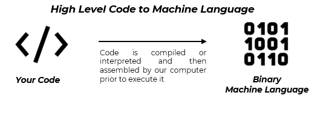{fig-align="center"}

High level code makes us very easy to program, but there are a lot of different languages, and they are created and used for different purposes, despite a same language can be used for doing different kind of things. We can group programming languages in two big groups:

- **Compiled.** These languages are directly transformed once correctly written to a low-level language, that can be transformed later to the machine language used by our computer.

- **Interpreted.** The different instructions written for these languages are being "interpreted" and executed directly one by one.

We can find language that use both systems or a mixture of them for working and being executed.

## Understanding your computer

We have explained the main idea and basic concepts of programming and how computers process these codes to execute the process we explain him. But, **¿what the main parts our computer uses to do all its tasks are?**, it is important to understand the powerful tool we are going to use to develop our code and perform tasks:

**Processor (CPU):** The main component responsible of executing the different instructions and compute calculations, prior to transform the high-level language to the machine language it uses.

**Memory (RAM):** Responsible of store the instructions, data and temporary resources needed for programs being executed by the processor. Is quick and with low capacity to focus only on the tasks being done.

**Hard Disk (HDD or SDD):** Computer main storage of data (programs and other files) persistently. It is very slow and with very high capacity, memory tends to access periodically to recover the information needed for our processor.

**Other devices (external) (I/O):** External storage devices, input, and output devices such as our screen, the keyboard or the mouse are also present and the help to interact with our computer, add more data, or visualize it.

Here is summary of our computer...

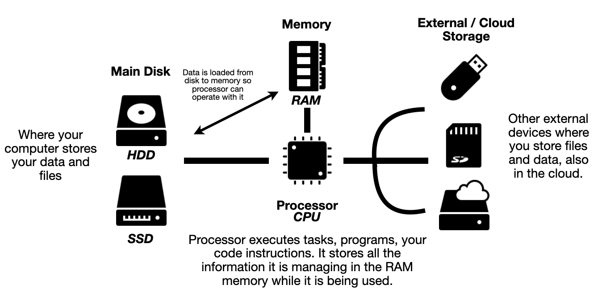{fig-align="center"}

\pagebreak

# R Programming Language {.unnumbered}

R is free open-source software environment created with the idea of offering a complete and advance tool for statistical computing, analysis, and visualization.

The language used in this environment is also called R. You can discover more about the R-project at their website (<https://www.r-project.org/>)

This language is fully supported by an enormous group of users, communities and groups dedicated to program and develop different tools. It is available at the main operative systems: Windows, MacOS and Linux distributions.

## R Installation

You can install R in your computer going to the official R website on [The R Project for Statistical Computing](https://www.r-project.org/)

In the website you can follow these simple steps:

1.  Go to the <https://www.r-project.org/> website and select *download R* option.

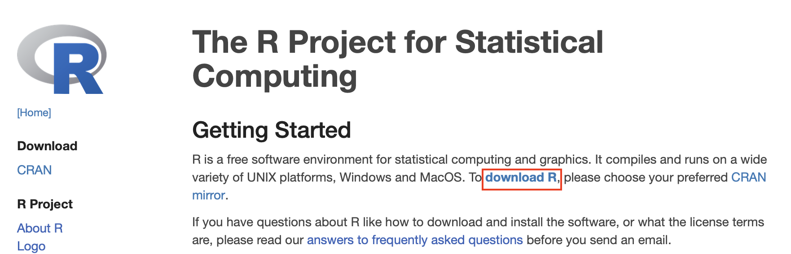{fig-align="center"}

2.  The website will show you the full list of CRAN repositories. A repository is a place where packages are located so you can install them from it. Although you or your organization might have a local repository, typically, they are online and accessible to everyone. Here we recommend select the one near your location, in our case Spain. This is the direct link to the recommended Spain repository: <https://cran.rediris.es>

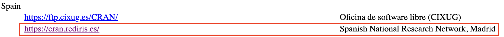

::: callout-note
## Learn more about repositories

Three of the most popular repositories for R packages are:

- **CRAN**: the official repository, it is a network of ftp and web servers maintained by the R community around the world. The R foundation coordinates it, and for a package to be published here, it needs to pass several tests that ensure the package is following CRAN policies.

- **Bioconductor**: this is a topic-specific repository intended for open-source software for bioinformatics. As CRAN, it has its own submission and review processes, and its community is very active, having several conferences and meetings per year.

- **Github**: although this is not R-specific, Github is probably the most popular repository for open-source projects. Its popularity comes from the unlimited space for open source, the integration with git, a version control software, and its ease to share and collaborate with others. But be aware that there is no review process associated with it.
:::

3.  Then on the Spain repository, select the desired R version according to your computer Operative System (OS): Windows, MacOS or Linux Distribution.

::: panel-tabset
## Windows

If your OS is Windows, select the option on the list and then select the first link **base**. This is the default installation of R we will use.

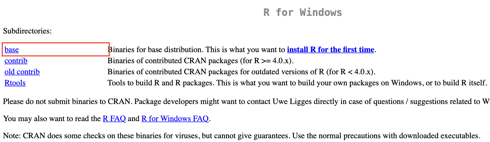

On the next screen select the main version of R and download the installation file.

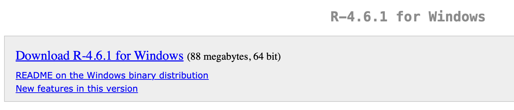

On your computer execute the installation file, and follow the instructions as it is your first time [accept the default installation options]{.underline}.

## MacOS

If your computer is a MacOS (Apple) select that option. On the next screen choose the version according to your processor.

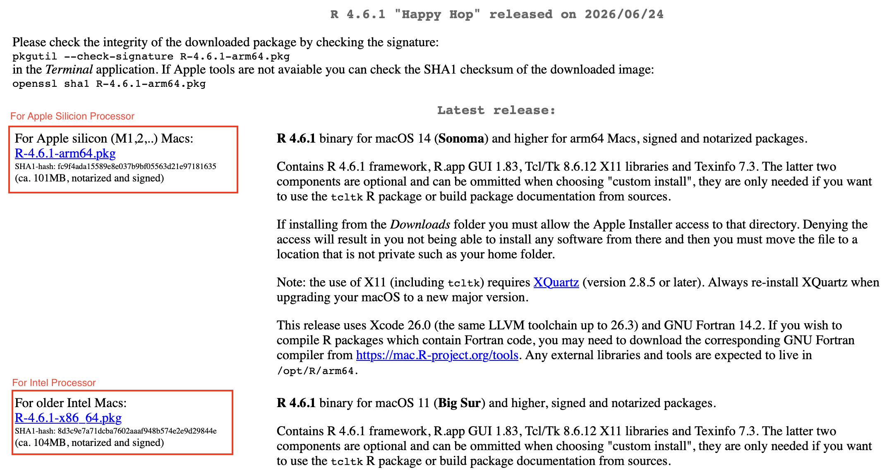

If your Apple computer is relatively new probably you will have a Apple Silicon processor (M1,M2,...), but if it is an older computer you may have an Inter processor. You can check it going to this [site](https://www.macworld.com/article/671418/how-to-check-the-specs-of-your-mac-find-out-processor-and-ram.html).

On your computer execute the installation file, and follow the instructions as it is your first time [accept the default installation options]{.underline}.

:::


## R Versions

When installing R you may have seen that it uses a number code. The number is relevant for understanding with **version of R** we are installing and using.

Version codes follows a three number code system, *i.e 4.4.1* The numbers are separated by a dot (.), each number represent relevant information of the version we are working with and they work in a sequential order.

> ***major.minor.patch***

The different parts of the release represent different things:

- **major**: a **significant change to the package** that may cause old code to not work. This is very rarely updated when the release has been redesigned in some way.

- **minor**: a minor version update means that **new functionality has been added to the package**. These can be new features or improvements to existing features that are supported by most of the existing code.

- **patch**: patch updates are **bug fixes**. They fix existing problems but do nothing new.

In addition, R versions include a name so the code is followed by a name given by the developers. Here is an example of some verions names::

* 4.0.0 "Arbor Day"
* 4.6.1 "Happy Hop"

## Other Software

If you are working with Windows you may need to install **Rtools**, this software is needed as a complement to you R installation to work with some additional R packages.

You can find the latest version of Rtools available [here](https://cran.r-project.org/bin/windows/Rtools/)


\pagebreak


# RStudio IDE {.unnumbered}

For working with R we can use the default programs that are installed with the installation of R done in the latest chapter. But this tools are too basic and may not offer enough functionalities to work properly.

We will use an specific Integrated Development Environment (IDE) called RStudio developed by Posit. An IDE is a software designed to support developers writing code as it includes different tools to support implementing and maintain our code for free.

## RStudio Installation

You can install RStudio going to the official [Posit RStudio website](https://posit.co/products/open-source/rstudio) here you need to select download RStudio option.

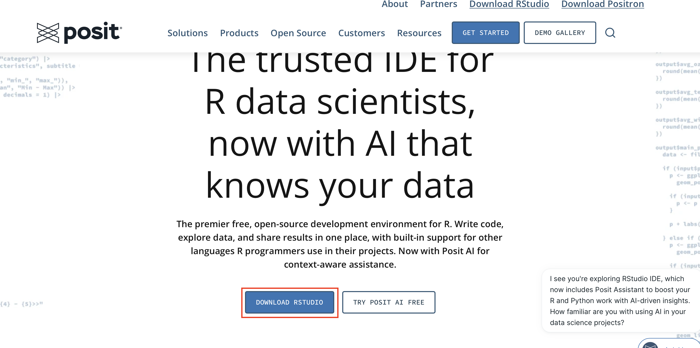{fig-align="center" width="390"}

On the next screen download the version of RStudio that fits with your Operative System (OS).

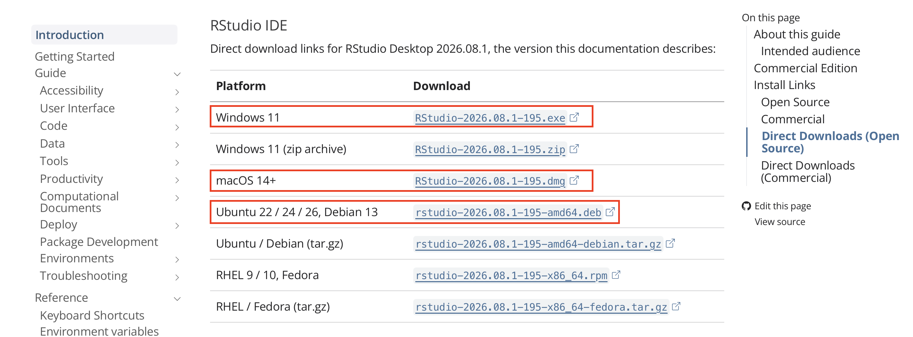{fig-align="center" width="518"}

On your computer execute the installation file, and follow the instructions as it is your first time [accept the default installation options]{.underline}

If all goes well you may see the blue icon of RStudio available on your computer.

{fig-align="center" width="56"}

## First Overview of RStudio

Now that we have everything installed in our computer we can start using it. Open the RStudio app and the following screen will be displayed.

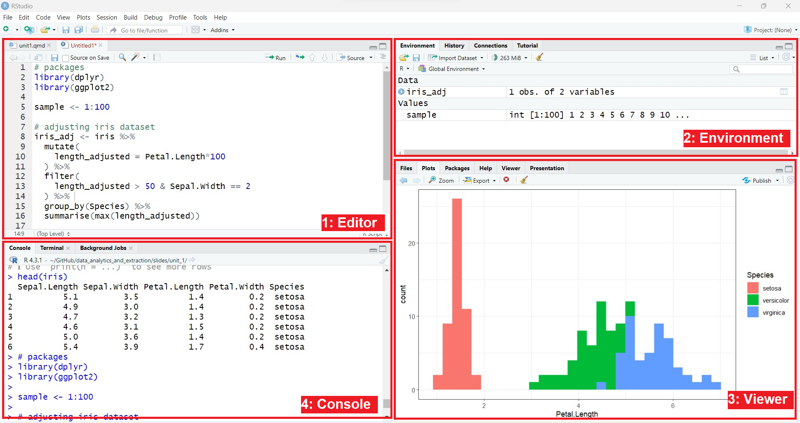{fig-align="center"}

On the screen you will see four tabs available...

1.  **File editor**: It shows the file or files we are working with, containing our code and comments. It is possible that this tab is now opened by default as it only appears when we have files open.
2.  **Multifunctionnal pane 01**: Environment storage and other configurations.\*\* This panel allows us to mainly view the variables that we have been creating in the R sessions (Environment), delete all the variables from the R memory
3.  **Multifunctionnal pane 02**: File browser, plot, slides, and viewer.
4.  **Console and terminal**: It allows us to communicate directly with R. A `>` symbol called a prompt will appear to indicate that R is ready to work. All our code will be executed here.

## Recommended Configurations

For working in the course we are going to review some of the key configurations you can do in your RStudio session.

For setting up your environment you need to go to Global Options pane, for doing that go to **Tools** section on the top header in the screen and choose **Global Options**.

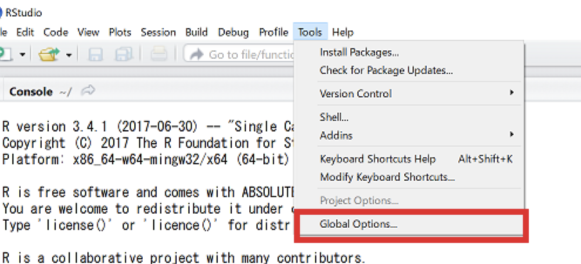{fig-align="center" width="476"}

Once on Global Options a new window will appear, we are going to check all of the different configuration you may use...

### General Settings

Here you can define general settings of your RStudio installation like the workspace general configurations.

::: callout-note
# Recommended Configuration

Here you may see an example of a recommended configuration you can have for this course:

1.  Un-check the `.RData` restore option and set "Save workspace on exit option" to `Never`. This is done for avoiding saving unnecessary data each time.
2.  Un-check bot History options to avoid saving unnecessary data and avoid issues each time we work in class.
3.  Remember to **apply each change** each time you modify something new.

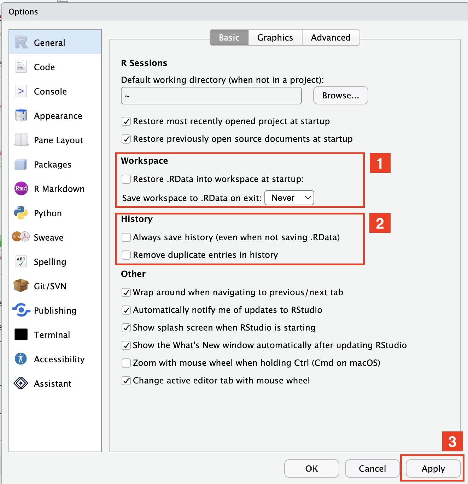{fig-align="center" width="323"}

:::

### Appearance Settings

You can modify the code appearance, font size and any other aspect on how the environment look like. Go to this link to know [more](https://docs.posit.co/ide/user/ide/guide/ui/appearance.html)

### Pane Settings

Understand all available configurations and how to adapt your pane view [here](https://docs.posit.co/ide/user/ide/guide/ui/ui-panes.html).

### Package Configurations

Finally, among the different configurations you can change the features on how to update your R base installation to obtain more code funtionalities. For doing this correctly we need to implement some recommended changes to our configuration in the RStudio.

1.  Change the primary CRAN repository to the most nearest, in this case Spain (Madrid)
2.  Un-Check the "Use secure download method for HTTP". Normally we won't remove this check as for safety resons is better to have it active, but as we are going to work in the organizational environment is better to not have it active to avoid errors due to network security.
3.  Remember to **apply each change** each time you modify something new.

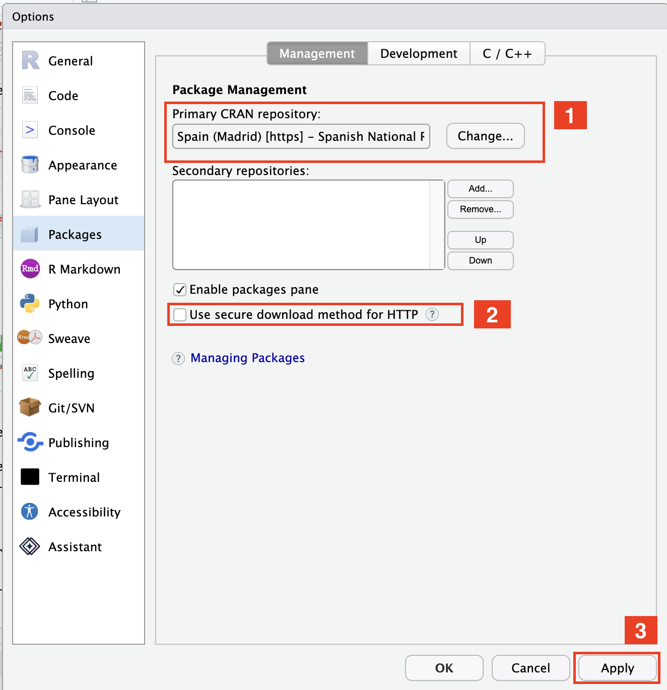{fig-align="center" width="316"}

\pagebreak

# Getting Started {.unnumbered}

## The Console

On our first interaction with R we are going to learn how to use the console. When you see the console the following message will appear when opening it for the first time.

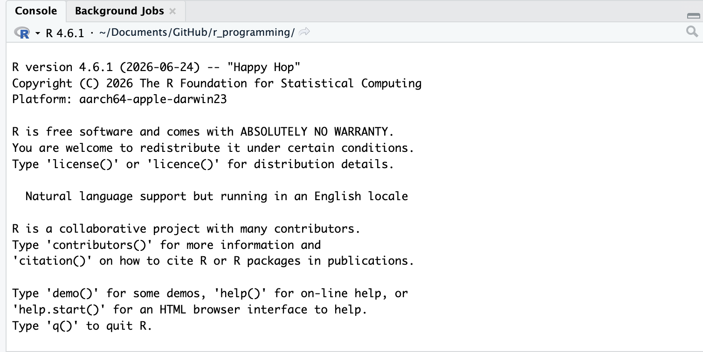{fig-align="center" width="377"}

This message shows us relevant information:

- R version code number
- Release date of the version
- R version nickname
- System we are working in (platform)

In addition we can see the **prompt**:

``` sh
>
```

When this symbol appears the console is asking as for inputs, here we can write code and commands so they are executed. Let's do an example typing the word `version` and press enter, you will see something similar to this output.

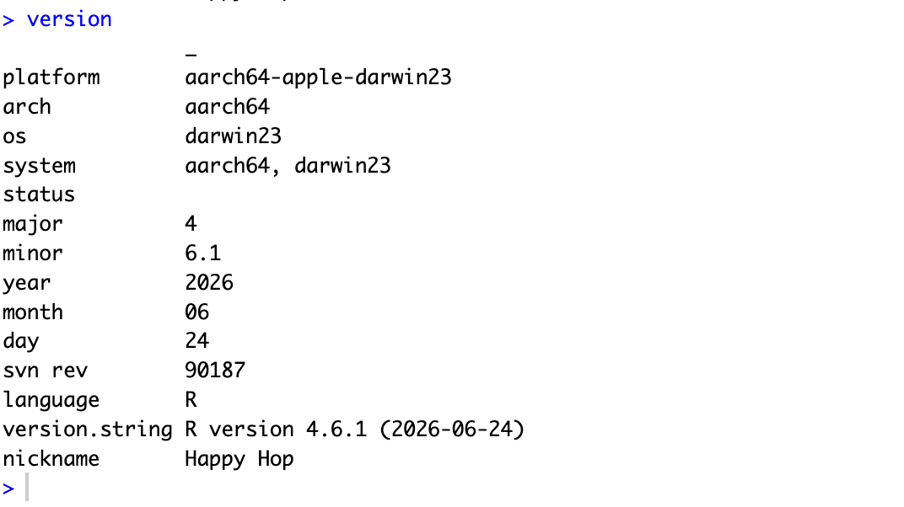{fig-align="center" width="377"}

\pagebreak

# RMarkdown & Notebooks {.unnumbered}

## What is Markdown?

Markdown is a plain-text formatting syntax that can be converted to XHTML or other formats, like PDF.

It is widely used for developing reports, documents, slides and any other of formats that include code, plots, images, etc.

It is widely used in Data Science and Scientific research, as it allows to create reproducible documentation and automate reporting processes.

## RMarkdown files

We have seen how to use scripts for running R code, but there are other possible files we can use. One of the most common files we can use in a data analysis environment are RMarkdown notebooks.

RMarkdown documents are files that combine both text and code in the same place, so you can generate full documentation and code to show tables, plots and other outputs to include in your documents. We can differentiate an script of R with a RMarkdown file seeing the extension. RMarkdown files use `.Rmd` extension.

## Creating a RMarkdown file

For creating an RMarkdown document go to File \> New File \> RMarkdown

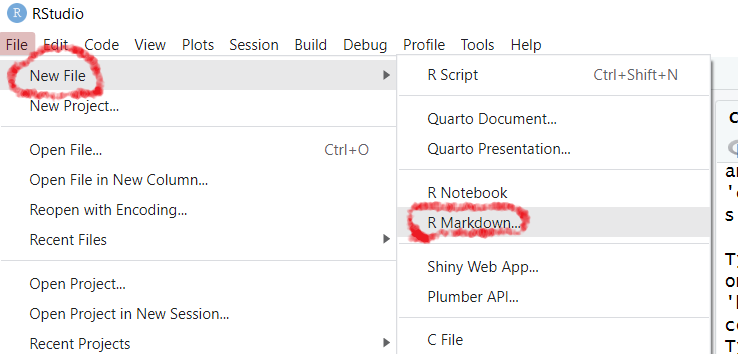{fig-align="center" width="454"}

In the creation pop-up enter the fields and output file type, we will use html or pdf this course (you can change them later)

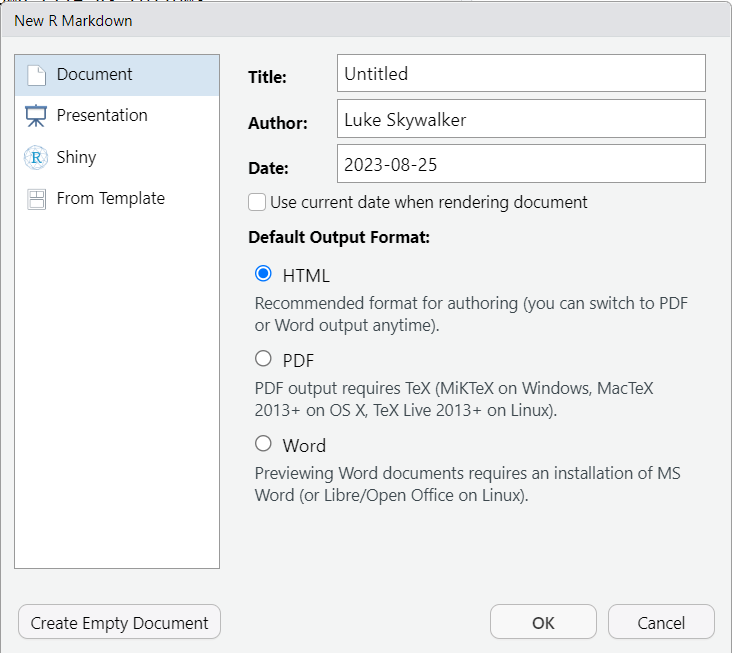{fig-align="center" width="371"}

## Parts of a RMarkdown file

In the file we can differentiate three parts:

1.  **YAML** header:

- It goes at the beginning between `---`
- It defines the title, author, date, and the output format (HTML/PDF/Word), options such as toc, etc.

2.  **Document body**: normal text.

3.  **R code chunks**: executable code blocks (chunks) and inline R code.

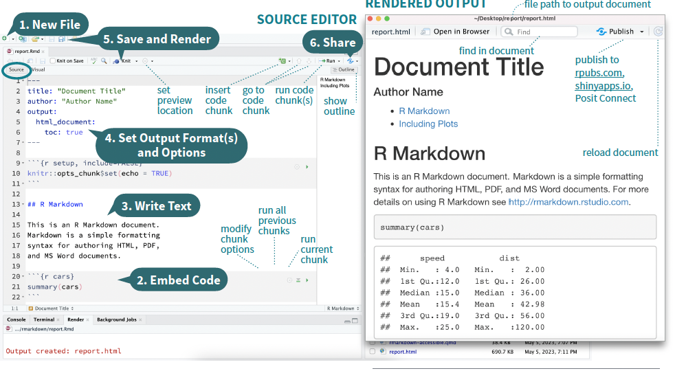{fig-align="center" width="504"}

### YAML part for rendering

Markdown files for R are divided in two parts, a first section where we can find file attributes like title, author and parameters for rendering. This is called YAML...

``` yaml
---
title: "Untitled"
author: "Luke Skywalker"
output: html_document
date: "2023-08-25"
---
```

**output** is the kind of document we want to generate, it can be...

- pdf_document (for generate a pdf)
- html_document (for generate a html website type)

more parameters are available to customize your file

## Rendering

When rendering R will execute each fragment of code in the file (if there are errors rendering will fail). It will generate a new version of the file in the selected output.

Normally a preview of the file will open once finished and the file will se saved in your working directory.

`knitr` package should be installed for doing the rendering as is the motor used. In case of generating a pdf you will need to have installed `tinytex` look for your PC needs in this case.

For rendering the file we need to press the `knit` button on the top of the document file. It will start an execution in the RStudio terminal and generate the desired file performing the renderization. Remember that in RMarkdown, rendering means converting your .Rmd file into the final document: Word, PDF, or HTML. Rendering both runs the code and creates the document.

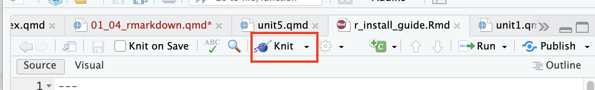

## Markdown Syntax

For writing text in markdown we have an specific syntax we need to use in the following pictures you can find a summary of all rules we can use for customize our text.

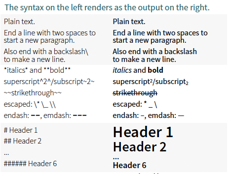

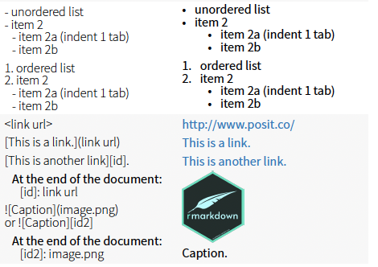

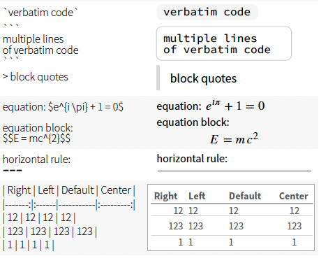{width="452"}

## Markdown Syntax: Code

Code chunks are the blocks in markdown were we type the code we want to include in the document. This code will be executed each time the document is rendered.

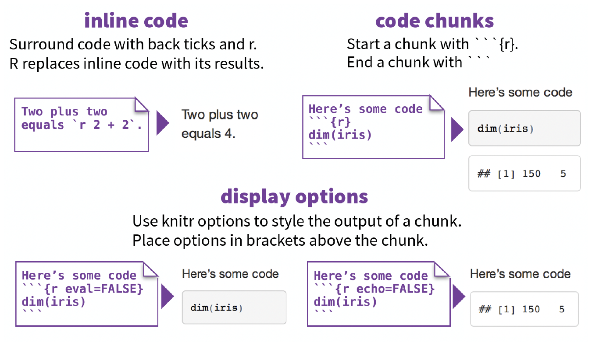{fig-align="center" width="425"}

Here you can see an example of a code chunk and the different functions available.

1.  Configuration block where we enter the programming language the code chunk is using (`r`) and other configurations regarding the behavior of the chunk.

2.  For running the cell we can use the green icon, and check the code is working at the same time we build the document.

3.  The output of the cell, here we can see what will be the output and what is going to be shown when the document is reendered.

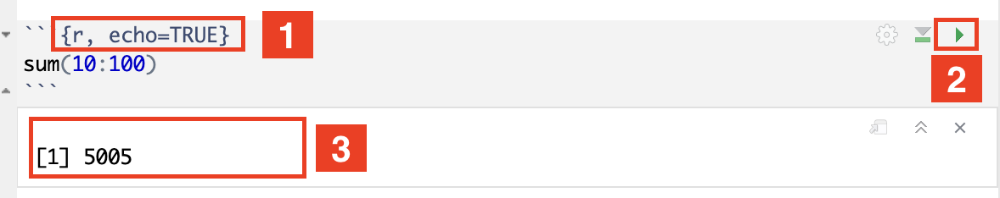{fig-align="center" width="425"}

You can enter specific configurations to your code chunks and change their behavior on execution. Here are the most common ones:

- **echo**, is used for displaying the code when the value is `true` (default) or `false` if we don't want to display the code.

- **eval**, is used for deciding to run the code or not. If eval is `false` the code won't be executed and no output will be displayed.

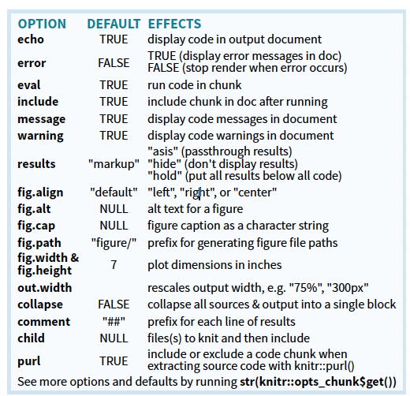{fig-align="center" width="380"}

::: callout-important
# Execution Order

The **order of the code chunks in the document matters**, if you use variables or other elements existing in other chunks you need make sure the cells are executed before the current cell.
:::
