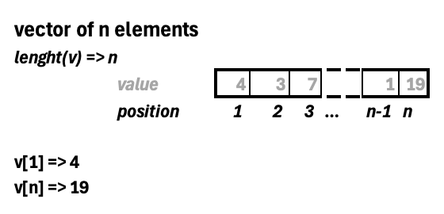

---

\pagebreak

# First Concepts of R

## Variables

As seen in the introduction of programming with R we can perform several operations in the R scripts. Like the one below...

```{r}
10 + 3
```

But in most cases we will need to store values so we can re-use them later.

Imagine that we need to keep a value or the result of an operation, for doing that, we need to store them on the memory with an identifier... a **variable**.

For creating a a variable we need to define the name and then assign a value or object that will be stored on the variable using the `<-` syntax.

```         
<variable_name> <- <value>
```

Let's see it with an example...

```{r}
# We define variable 'a' that stores number 10
a <- 10
a
```

Then we can use the value stored on variable `a` and use them in more operations.

```{r}
# We increase by 3 and store the result on new variable 'b'
b <- a + 3
b
```

::: callout-tip
# Environment

Each time you create a variable or object it will appear on the *Environment* tab, so you can have control of all elements you have created.

{fig-align="center" width="403"}
:::

::: callout-important
# Naming Variables

When naming variable take into account that it **cannot start by a number** and **cannot have special characters** such \@, **\$**, etc.
:::

Consider that the variables can be overwritten, so if you assign a new value to an existing variable their value will change.

```{r, echo=TRUE}
c <- 5
c
```

```{r, echo=TRUE}
c <- 20
c
```

You can control all existing variables and their content in the *Environment* tab on RStudio. But you can also check tipyng the `ls()` function on the console or your script it will return the existing variables in your environment.

```{r}
ls()
```

In the other hand, you would like to clean all variables at some point. You can use `rm(list=ls()))` command, to clean all variables. Being `rm()` the remove function and on the function we will provide the list of variables to delete.

Clean variables is important when we are not going to use them anymore as it will free space in the memory of your computer allowing to be used for other processes and other variables.

## Introduction to Functions

Functions are already created code programs we can use. They are pre-built and available on R and we can call them to perform quick operations, instead of creating the whole code. We have seen some examples in the variables section.

The have a defined name and normally are followed by parenthesis `()`, inside the parenthesis we can include additional arguments to the function (inputs) that are needed to perform the operation we want to do (not all functions have arguments). The function will return the result.

``` r
<function_name>(<arguments_1>, <arguments_2>, ..., <arguments_n>)
```

R has different pre-defined functions we can use...

```{r, echo=TRUE}
# compute the mean from number 1 to 10
mean(1:10)

# we can combine functions
round(mean(1:10))
```

In the examples we have seen we have computed the mean of ten numbers, so the function `mean()` has one arguments we need to enter that is the numbers to use in the computation (we have provide with a range `1:10`). In the second case we have use the output to round it removing decimal numbers with `round()` function whose input arguments is the value to round.

As we have seen functions can have multiple arguments, with a name each one. When providing arguments we can enter them by name or we can provide them without naming the arguments, in the second case we need to enter them on the same order they are expected to be included. We can check the order and the arguments in the function documentation.

```{r, echo=TRUE}
# sample a number between 1 to 10
sample(x = 1:10, size = 1)

# we don't need to use the name if we follow the same order
sample(1:10, 1)
```

You can see the arguments of a function using `args()` function.

```{r, echo=TRUE}
args(sample)
```

Some arguments have a default value, so you don't need to provide one always. See `round()` function for example.

```{r, echo=TRUE}
args(round)
```

In the function `digits` have default value as 0, so if we do not provide a value for that argument the function will use the value 0.

If you have doubts of about any function, its arguments or how it works you can use `?` command to see the official documentation.

``` r
? round
```

This will show the documentation of the function in the *Help* tab of RStudio.


Here you have a summary of frequently used functions in R:

| Function     | Use                                   |
|--------------|---------------------------------------|
| `log()`      | computes the logarithm                |
| `exp()`      | computes the exponential              |
| `min()`      | computes the min number               |
| `max()`      | computes the max number               |
| `sum()`      | computes the sum                      |
| `mean()`     | computes the average                  |
| `median()`   | computes the median                   |
| `var()`      | computes the variance                 |
| `sd()`       | computes the standard deviation       |
| `quantile()` | computes quantiles 0, 25, 50, 75, 100 |
| `cor()`      | computes de correlation               |

\pagebreak

# Objects

An object in R is a data structure that has some attributes and methods (functions)...

We will see the following objects:

1.  Basic types (numeric, characters and logical)
2.  Vectors
3.  Lists
4.  Data frames
5.  Matrix
6.  Arrays
7.  Datetime
8.  Factors

## Basic Types

For programming R uses different data types that we need to know and understand. Data types are the basic objects we will work with and that are used to create much more complex objects.

#### numeric

`numeric` type is the one used for working with numbers...

```{r}
c <- 5
d <- 6
c + d
```

You can know the type of an object using the function `class` to know the exactly which one you are working with.

```{r}
class(d)
```

Inside `numeric` class we can have different sub-types as it is a family of types for representing all number formats.

```{r}
# typeof checks the inner type inside the class
typeof(d)
typeof(1.5)
typeof(1L) # integer
```

::: callout-tip
# `class()` or `typeof()`

You have seen we have use `class()` and `typeof()` method to identify an object type.

- `class()` is more generic as it identifies the object class, a basic R structure that defines a common properties shared with types of the same class.
- `typeof()` is more accurate to the specific type.

In some cases (mostly) it will return the same output.
:::

But if we want to verify that an object is `numeric` we can use the `is.numeric()` function. That will check if the object is from class numeric.

```{r, echo=TRUE}
# Check if a value is of certain type
is.numeric(1L)
```

See that the function returns a "word" called `TRUE`. This is not exactly a word is an other type called `boolean` that we will learn later. In this case `TRUE` means that the object is a numeric type.

#### character

`character` data type is the one used for working with texts.

```{r, echo=TRUE}
sentence <- "may the force be with you"

typeof(sentence)
```

You can know the number of letters an object of type character has with `nchar()` function (number of characters). Consider that white spaces are also characters.

```{r}
nchar(sentence)
```

You can transform to one type to another. For example, we have a number written as a character and we want to use it as a number.

```{r, echo=TRUE}
number <- "20"

10 + as.numeric(number)
```

You can do the opposite too... transform a number to a text with `as.character`

```{r, echo=TRUE}
num <- 10 + as.numeric(number)
num 

as.character(num)
```

#### logical

Also known as *boolean* values,

```{r}
class(TRUE)
class(FALSE)
```

Normally they are the result of the evaluation of logical expressions (conditions)

```{r}
class(1 == 1) # equal
```

```{r}
1 > 5
```

Here you have a summary of different possible conditions...

Summary of logical operations...

| Operator | Definition             | Use example (*all of them are TRUE*) |
|----------|------------------------|--------------------------------------|
| `==`     | Equal                  | `10 == 10`                           |
| `!=`     | Distinct               | `10 != 20`                           |
| `>`      | Higher                 | `10 > 9`                             |
| `>=`     | Higher or Equal        | `10 >= 9`, `10 >= 10`                |
| `<`      | Lower                  | `9 < 10`                             |
| `<=`     | Lower or Equal         | `9 <= 10`, `10 <= 10`                |
| `%in%`   | Is inside a collection | `9 %in% c(1,8,9,10)`                 |

They can be seen as numeric values too, this is **coercion**, again...

```{r,echo=TRUE}
TRUE == 1
FALSE == 0
```

::: callout-tip
# Basic Types Functions

We have seen that we can use several functions to transform between types and also to check types.

**Transformation Functions**

| *function*       | *decription*           |
|------------------|------------------------|
| `as.numeric()`   | to change to numeric   |
| `as.character()` | to change to character |
| `as.logical()`   | to change to logical   |

**Type Verification Functions**

| *function*       | *decription*          |
|------------------|-----------------------|
| `is.numeric()`   | to check to numeric   |
| `is.character()` | to check to character |
| `is.logical()`   | to check to logical   |
:::

## Vectors

In the last data types we have work with a single value or element, but sometimes we will need to work with a collection of elements. A **vector** is collection of elements of the **same data type**

```{r}
numbers <- c(1, 2, 3.23, 4.223, 5.21, 6.6)
words <- c("hotel", "dinosaur", "transport")
logical <- c(TRUE, FALSE, TRUE, FALSE, TRUE, TRUE)

numbers
```

If we check the data type of a vector it will return the basic type of its values. So **a vector can only be of a single basic type**.

```{r, echo=TRUE}
typeof(words)
```

In fact, if you try to create a vector of different types. R will try to understand the basic type and apply it to all elements. This is called **coercion**. Read more about **coercion** [here](https://rstudio-education.github.io/hopr/r-objects.html#coercion).

```{r, echo=TRUE}
a <- c(1,2,3,"Hola")
a
```

If you want to check that an object is a vector you can use `is.vector` function.

```{r, echo=TRUE}
is.vector(words)
```

### Selection of elements

As vectors have several values, we will want to access the different elements individually. For doing that we just need to enter the position we want to access to.

```{r}
# vectors position start at 1
words[1] # first element
```

And you can access a range of elements directly...

```{r}
numbers[2:4]
```

And make a much more wise selection using a vector with the position, in the example we want elements 1 and 4. It will return a new vector with the values of the selected positions.

```{r}
numbers[c(1,4)]
```

For vectors, we have an specific function to know exactly the number of elements we have in the vector: `length()`

```{r}
length(words)
```

To summarise everything we know about vectors you can check this schema:

{fig-align="center" width="366"}

::: callout-caution
# Exercise: Selecting values of a vector

Using the following vector `v <- seq(1,200,4)` select the last 10 elements
:::

### Modification of elements

Using the selection syntax we have seen we can also modify parts of the vector, instead of changing the whole vector.

```{r}
vec <- 1:10

# Modifying values with single selection
vec[3] <- 300
vec
```

And you can modify multiple elements if needed:

```{r}
# Modifying values with multiple selection
vec[c(1,4)] <- c(100, 400)
vec
```

```{r}
# Modifying a full range of values
vec[c(5:7)] <- vec[c(5:7)] + 100
vec
```

### Operations with vectors

In the last example of modification we have seen what we call an **element-wise operation**

R is capable on adapt the operations with vectors depending on their size to apply the operation to all elements.

- Vector - Number: it will apply the same operation with that number to all elements of the vector

```{r, echo=TRUE}
b <- 1:10
b
b + 7
```

- Vector - Vector (same length): it will apply the operation between the same positions of each vector.

```{r, echo=TRUE}
b
b * b
```

- Vector - Vector (different length)

```{r, echo=TRUE}
d <- 1:2 # length = 2
e <- 1:4 # length = 4

# Showing vectors
d
e

# Product of both vectors
d * e
```

When doing a operation of vectors with different length, R will compare both of them. The shorter one will try to adapt to the size of the bigger one, so elements will be repeated on the short vector until it reaches the larger one. If the short one cannot cover the larger one R will show you a warning message.

```{r, echo=TRUE}
f <- 1:3 # length = 3
g <- 1:4 # length = 4

# Product of both vectors
f * g
```

::: callout-note
# Warning messages

A **warning** in programming is a message shown by the computer informing us of an undesired behavior in the execution. They are not errors as the code has been able to perform the execution successfully but it inform us in case the operation has not been done correctly.
:::

## Lists

As we have seen vectors can only contain elements of the same data type, if we need to create a **collection of elements of different types** we should work with lists.

```{r}
mylist <- list(c("A", "B"), 1:10, Sys.time())
mylist
```

In contrast with vectors, lists are considered a data type (object):

```{r}
class(mylist)
```

### Selection of elements

For acceding the elements of a list we need to consider that each position of the list stores objects inside. So we have two ways of acceding the elements:

- Acceding the position (similar to vectors)
- Acceding the element inside that position

```{r}
# acceding at the second position of the list
mylist[2]

# acceding at the second element of the list
mylist[[2]]

```

To understand the difference look what happens when we ask for the types...

```{r}
class(mylist[2])

class(mylist[[2]])
```

In the first case we are obtaining a new list with the element selected. While on the second case we exactly obtaining the element, in this case a vector of characters.

One insteresting fact of lists, is that you can assign names to the each elements...

```{r}
# Now each element of mylist2 has an assigned name
mylist2 <- list(letters = c("A", "B"), numbers = 1:10, time = Sys.time())

mylist2
```

These names can be used for accessing each element too:

```{r}
# acceding at the first position by name
mylist2["letters"]

# acceding at the first element by name
mylist2[["letters"]]

# Other option using $ syntax if the names have no spaces
mylist2$letters
```

If you are not sure if the list you are working with has names in their elements you can use the `attributes` function.

```{r}
attributes(mylist2)
```

You can see that this list contains some names defined. You can also use `names` function to see it.

```{r}
names(mylist2)
```

## Matrix

We use it for storing bi-dimensional structures...

```{r, echo=TRUE}
m <- matrix(1:10, nrow=2)
m

m <- matrix(1:10, nrow=2, byrow=TRUE)
m
```

We can check number of elements in each dimension of the matrix.

```{r, echo=TRUE}
ncol(m)
nrow(m)
```

## Arrays

```{r, echo=TRUE}
array(1:12, dim = c(2,2,3))
```

## Datetime

We can manage dates and time inside R...

```{r, echo=TRUE}
hour <- Sys.time()
hour

typeof(hour)

class(hour)
```

## Factors

Factors are used to store categorical variables, with a fixed level of categories...

```{r, echo=TRUE}
addict <- factor(c("YES", "NO", "NO", "YES"))
attributes(addict)

# We can pass from a factor to a character
addict <- as.character(addict)
class(addict)
```

\pagebreak

# Data Frames

A Data Frame is bi-dimensional object that combines attributes from latest seen objects. It is composed by two dimensions:

- **Columns** that work similarly vectors, containing values of the same type each one.
- **Rows** that work similarly as lists, containing the different possible values for each column.

We can create a data frame specifying each column (each column behaves like a vector):

```{r, echo=TRUE}
df <- data.frame(
  id = 1:4, 
  company = c("Apple", "Google", "Microsoft", "Huawei"), 
  share_dif = c(3.4, -2.5, 10.1, -0.05), 
  consolidate = c("YES", "NO", "NO", "YES")
)
df
```

This data frame has five columns: id, company, share_idf and consolidate. And four rows containing the possible values for each column.

As with lists, data frames are objects:

```{r, echo=TRUE}
# Check the class
class(df)

# Summary the information
str(df)
```

Remember the data frame will be accessible through *Environment* tab. Here you can check each column, their type and a sample of values. Like the output of the Summary we have obtained.

## Dimensions

As we have said data frame are bi-dimensional structures. You can check the dimensions of a data frame using `dim` function.

```{r}
dim(df)
```

The first value is the number of rows, and the second the number of columns. You can explore them separately...

```{r}
ncol(df) # number of columns
nrow(df) # number of rows
```

And you can check the columns that the dataframe has...

```{r}
names(df)
```

## Selecting elements

For selecting elements in the dataframe we need to work with its bi-dimensional structure, so we need to provide information of the position...

`dataframe_name[rows, columns]`

We can retrieve a single row...

```{r}
# First row
df[1,]
```

We get a **dataframe** with the first row only

We can retrieve a single column...

```{r}
# Second column using position
df[,2]

# Second column using name of the column
df$company
```

We get a **vector** with all the elements of the column.

We can retrieve an specific register providing both elements. Using two possible syntax.

```{r}
# First element of second column by position
df[1,2]

# First element of second column by name and position
df$company[1]
```

### Advance selection

You can make more complex selections...

```{r}
# Multiple elements
df[1:2, 2:3] # firs and second rows of columns 2 to 3

# Negative numbers in the selection
df[-c(1,2),1:3] # last two rows of columns 1 to 3
```

Using negative values makes the dataframe do reversed selection, all except the ones informed.

```{r}
df[,-2] # All except second column (company)
```

And other examples...

```{r}
# Using logical values
df[1,c(TRUE, TRUE, FALSE)]

# Selection with column names
df[c(1,3), "consolidate"]
```

## Filtering

You can select elements by filtering the data frame depending on conditions. For doing that you need to use conditional **logical** expressions on the row part of the selection.

We want to select all companies with a positive share_dif:

```{r}
df[df$share_dif > 0, ]
```

Rationale...

We want registers with a positive share_dif, this means that all rows with a value on share_dif higher than 0 should be selected. If the type the condition:

```{r}
df$share_dif > 0
```

We get a vector of logical values, if the provide this vector to the selection syntax of the data frame rows it will get all rows whose position is `TRUE`.

```{r}
filter <- df$share_dif > 0
df[filter,]
```

::: callout-tip
# Combining logical expressions

Combining logical expressions with Boolean expressions can be done using special operators:

- `&` for AND, both expressions must be successful to pass the condition.
- `|` for OR, if any of the expression is successful the whole condition will be met.

```{r, echo=TRUE}
exp1 <- 5 > 3
exp2 <- "A" != "A"
exp3 <- 3 %in% c(1,2,3)
# AND
exp1 & exp2

# OR
exp1 | exp2

```

The order for this combinations matters, the most critical condition needs to be put on the left part of the whole structure to be evaluated first.

Also, you can express the opposite of a condition adding `!` operator at the left:

```{r}
# Negation
!exp1
```
:::

::: callout-caution
# Exercise: Using filters

Filter the data frame `df` used in the examples to return all registers that have a negative share_dif and that consolidate (YES).
:::

## Modification

You can add a new column to the data frame.

```{r, echo=TRUE}
# Adding a new variable to the data frame
df$in_stock <- c(1,1,1,0)
df
```

We have defined a new column name and assign a vector containing the values for the column.

And you can drop a column following the `NULL` syntax.

```{r}
# Adding a new variable to the data frame
df$consolidate <- NULL
df
```

You can modify a single value, using the selection syntax seen before:

```{r}
# Modifying an specific value
df[1, "share_dif"] <- df[1, "share_dif"] + 1.4
df
```

\pagebreak

# Programming Structures

Programming structures are essential to control and manage your code flow, the two main programming structures used are...

- **Conditional structures.** Allows us to control if a certain piece of code needs to be executed depending on a logical condition.

- **Iterative structures (loops).** Allows us to perform repetitive tasks with less code.

## Conditional Structures

Conditional structures check if a condition is met, and if it is true an specific code will be executed.

``` r
if(condition){
 do this if the condition is TRUE
}
```

Look at the example below:

```{r}
x <- 3
if (x > 2) { 
  print("x is greater than 2")
}
```

You can manage alternative path for your code with `else` statement.

``` r
if(condition){
 do this if the condition is TRUE
} else {
 do this if the condition is FALSE
}
```

And you can manage more conditions with `else if`, that allows you to include an additional condition to apply.

``` r
if(condition 1){
 do this if the condition 1 is TRUE
} else if (condition 2) {
 do this if the condition 2 is TRUE
} else {
 do this if none of the conditions are TRUE
}
```

Here you have a full example with the whole structure:

```{r}
x <- 2
if (x > 2) { 
  print("x is greater than 2")
} else if (x == 2) {
  print("x is equal to 2")
} else {
  print("x is less than 2")
}
```

1.  It will check if the value is greater than 2. If it is it will return "x is greater than 2" message.
2.  If it is not greater than two, it will check if it is equal to 2. If it is equal it will return "x is equal to 2".
3.  Finally, if none of the last two conditions are met, it will display a message "x is less than 2"

::: callout-caution
# Exercise

Check the following piece of code, what will be the result and why? Hint: %% is the module operation returning the rest of a division

```{r}

a <- 10
b <- -3

# %% operator will return the module of a division
# we check if the value is even
if(a %% 2 == 0 & b %% 2 == 0){ 
  c <- a / 2 - b / 2
} else if(a %% 2 == 0 & b < 0){
  c <- a / 2 - b
} else {
  c <- a + b
}
c
```
:::

## Iterative Structures (Loops)

Iterative operations, also called **loops**, are designed to perform repetitive tasks without needing to rewrite the same code multiple times.

We can use different kinds of loops, here we will learn **for** and **while**.

### For loop

For loop is used for perform a task a limited number of times. It is commonly used for travelling through a collection (vector, lists or data frames).

``` r
for (value in collection){
  do this
}
```

Here an example:

```{r}
for(x in c("A", "B", "C")){
  print(x)
}
```

### While loop

It is used for repeating a task while a condition is met. When the condition is not successful the loop will stop.

``` r
while (condition){
  do this
}
```

```{r, echo=TRUE}
x <- 0
while(x < 8){
  print(x)
  x <- x + 1
}
```

::: callout-caution
# Exercise

Given the following vector `v <- sample(1:20,10,replace=FALSE)` compute with a loop the total of the sum of all the elements of the vector. Hint: To check that your code is correct the result of the loop should match the value returned with `sum(v)`.
:::

## Creating Functions

As we have seen you have multiple functions available on R to perform several tasks. But, you can also create your own functions so you can use the same function multiple times without needing to write the code.

For doing that we need to follow the structure:

``` r
my_function <- function(){}
```

For example we want to create a function that prints "Hello!" on the console.

```{r}
say_hello <- function() {
  print("Hello!")
}
```

Now we will use the function:

```{r}
say_hello()
```

Sometimes we will want the function to perform actions given some value and then return the output. For example, we want to write a function that given a number it divide the number by 2 and returns the result.

```{r}
divide_by2 <- function(x) {
  y <- x/2
  return(y)
}

divide_by2(10)
```

The output can be stored to be used later

```{r}
b <- divide_by2(10)
b
```

We can also define default values, so in case the user doesn't provide a parameter the function can be executed without errors.

```{r}
divide_by2 <- function(x = 2) {
  y <- x/2
  return(y)
}

divide_by2()
```

::: callout-caution
# Exercise: Create a function

Create a function called `mult_vector` that given a vector and a number it should multiply each element of the vector by that number and return the new vector. Add a default value of 1 for the number so if it is not provided it will return the same vector. Also, include a control structure in the code, so if the default value is used the function should print a message on the console "No multiplier provided using 1 as default!".
:::
