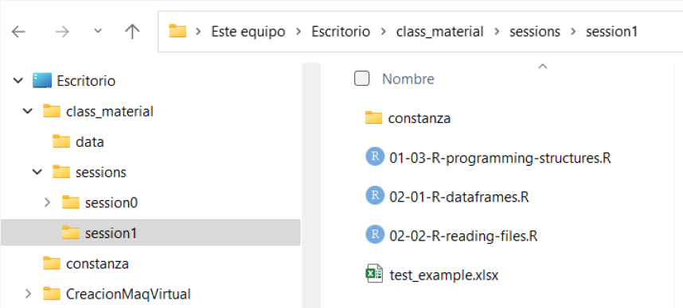
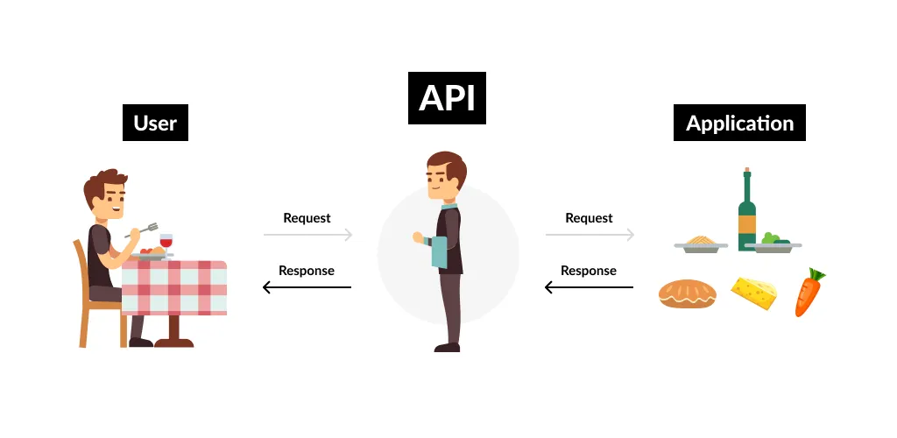
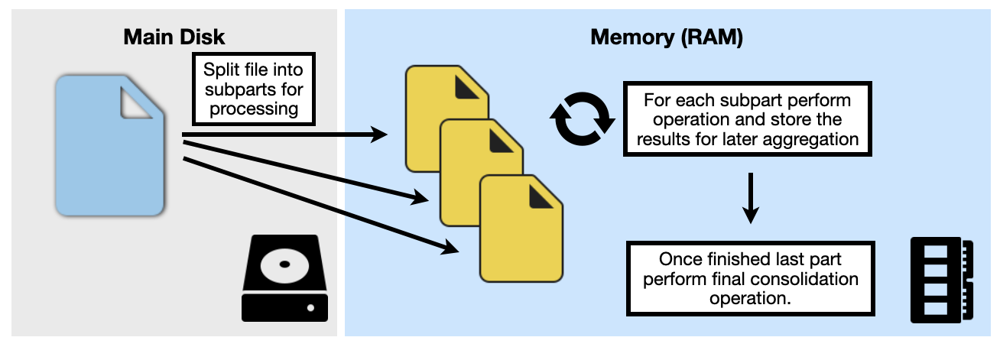

\pagebreak

## Data Wrangling

**Objective**: Make data ready for their future **exploration** and **modelling**

We need to convert **raw data** into **processed data**

### Raw Data

- Data as it appears on the source origin.
- Any manipulation has been done to them.

### Processed Data

- Each variable in a column.
- Each observation in a raw.
- Each observational unit is a cell.
- More complex data, interconnected tables.

The process work as follows...

1.  Importing the data
2.  Organizing the data

{fig-align="center" width="426"}


\pagebreak

# Basic Concepts {.unnumbered}

## Understanding the path and working directory

When working in our environments R will need a working directory, the place where it is located inside your computer.

For managing it two functions are essential `getwd()` and `setwd()`

```{r}
#| eval: false
#| code-line-numbers: false
# Returns the currect working directory
getwd()
```

```{r}
#| eval: false
#| code-line-numbers: false
# Change the working directory
setwd("./data")
```

## Creating a path

For navigating inside your computer you need to know how to build the paths... we can consider two types of paths when deciding how to tell our computer where we are...

- **Absolute Path**

- **Relative Path**

Let's understand the difference between each one with an example...

**Homer works in the Nuclear Plant where it is?** In this case we provide a full direction telling Homer where the place is.

{fig-align="center" width="406"}

This is what we call an **Absolute Path**, as we provide the exact position independent of the position.

**Homer works in the Nuclear Plant how he can go?** In this case we are trying to find the location considering an starting point and we need to provide a route to go from that point.

{fig-align="center" width="410"}

This is what we call a **Relative Path**, as we provide a route to the file considering the place we are in.

Now that we have the explanation of each kind of path definition, this is how we write each one in our code:

In the **absolute** one we define the position of the file starting from the *root folder* of our computer. Then we define each directory our computer needs to go to until finding the final destination.

```{r}
#| eval: false
#| code-line-numbers: false
# ABSOLUTE
# Linux / MacOS
setwd("/home/carviagu/data") 

# Windows 
setwd("C:/Users/carviagu/data") 
```

If you are not sure were your root folder is you can use `"~./"` as a placeholder.

In the **relative** one we define the position of the file starting from the *current folder* we are in. Then we define each directory our computer needs to go to until finding the final destination.

```{r}
#| eval: false
#| code-line-numbers: false
# RELATIVE
# from my current position
setwd("./data") 
 # from main folder
setwd("/Users/carviagu/data")
# one level up
setwd("../peter") # one level up
```

Here you have a practical example of relative paths. Considering the following folder structure...

{fig-align="center" width="422"}

An that you are at the `session1` folder...

- You want to access `test_example.xlsx` file, your path could be `"test_example.xlsx"`
- You want to access a file called `test2.csv` at `constanza` folder, your path could be `"constanza/test2.csv"`
- You want to access a file called test3.csv located at sessions folder, your path could be `"../test3.csv"`. As your going a level up in the folder structure we need to use `../` syntax.

## Importing data

We will learn how to import, download and read data in R. Mainly focused on **tabular** data.

As we have seen we will continue using the **tidyverse** ecosystem, focused on the main packages available for importing data into our environments.

```{r, echo=TRUE}
#| eval: false
#| code-line-numbers: false
library(tidyverse)
```

We will follow this schema...

- Download data
- Read and Write data with tidyverse packages

\pagebreak

# Reading Data {.unnumbered}

## Downloading data

We are going to learn how to create a folder called **data** from R and download data inside it.

1. Check if the folder **data** already exists in the current directory, if not you can create it.
Use the following functions...

* `file.exists()`
* `dir.create()`

2. Download the data about elections participation on Madrid Community (Spain) from the [following url](https://datos.comunidad.madrid/catalogo/dataset/929442fc-fef2-4f73-85a4-c4b02328531e/resource/4139576d-a11f-42be-a8de-48d37739f044/download/datos_electorales_elecciones_autonomicas_comunidad_de_madrid_2023.csv): 

```{r}
#| eval: false
#| code-line-numbers: false
data_url <- "https://datos.comunidad.madrid/catalogo/dataset/929442fc-fef2-4f73-85a4-c4b02328531e/resource/4139576d-a11f-42be-a8de-48d37739f044/download/datos_electorales_elecciones_autonomicas_comunidad_de_madrid_2023.csv"
download.file(data_url, destfile="../data/elections_data.csv")
list.files("./data")
```

## CSV files

Comma Separated files are designed to export and manage data in plain text, they are more interesting for storing tabular data. They use a delimiter like `,` for example to separate each value. The first row will be column names. 

Learn more about CSV file an their properties [here](https://www.howtogeek.com/348960/what-is-a-csv-file-and-how-do-i-open-it/)

## Importing Data with R-base: `read.table()`

In R base we have `read.table()` functon to read data in simple way.

```{r, echo=TRUE, eval=FALSE}
# This is how we can read data with read.table
# IMPORTANT: the file uses ; as separator
elections_data <- read.table("../data/elections_data.csv", 
                             header = T, sep = ";")
head(elections_data, 5)
```

```{r}
elections_data <- read.table("../data/elections_data.csv", 
                             header = T, sep = ";")
head(elections_data, 5)
```

Some important parameters...

* **header**: TRUE if the file contains the column names in its first row, FALSE otherwise. 
* **sep**: type of separator being use in the data: (`,`,`;`,`|`, etc.)
* **na.strings**: choose which kind of character will represent the `NA` value. 
* **nrows**: maximum number of rows to read
* **skip**: number of rows to skip from being read.
* **col.names**: vector with the names to use as columns, if the file contains a first row with columns use `header = F`


## Tidyverse: `readr` package

With **tidyverse** we have the **readr** package for reading data...

```{r,echo=TRUE, message=F}
library(tidyverse) # library(readr) for using single package
```

All `readr` function will do the data transformation and return a *tibble*. Some of the available functions...

* `read_csv()` - files using `,` as delimiter
* `read_csv2()` - files using `;` as delimiter
* `read_tsv()` - files using tabulator as delimiter (`|`)
* `read_delim()` - files using another type of delimiter, we will need to provide it as an argument. 

By default the function to read CSV files is `read_csv`. 

```{r}
iris_df <- read_csv("../data/iris.csv")
iris_df
```

`read_csv` has been designed to read files that use a comma (`,`) as delimiter. 


We can find some cases where the delimiter is different. The most common case occurs when we are working with files coming from *European* countries. 

Look at the following file:

```{r}
iris_df2 <- read_csv("../data/iris_esp.csv")
iris_df2
```

Looks something is not correct when reading the file, the whole data is stored in a single columns not separating them correctly. If we see the file we will detect that the variables are separated using `;` delimiter, we can try another function then: `read_csv2`

```{r}
iris_df2 <- read_csv2("../data/iris_esp.csv")
iris_df2
```

Now the file has been red correctly. `read_csv2` has been designed to import data using a `;` delimiter that is very frequent on *European* countries and *Hispanic* cultures. While other countries trend to use `,` separator by default. 

In addition we can find files using more specific delimiters different from the frequent ones. For much more specific cases we can use `read_delim` that has been designed for reading custom delimiters.

```{r}
iris_df3 <- read_delim("../data/iris.txt", delim = "|")
iris_df3
```

In this case we define on the function the delimiter being used in the file so R can separate each variable accordingly. 

## Useful parameters for reading files

In your reading functions you will found useful parameters you can define to adapt the reading depending on the file content.

### Skip lines of the file

You can skip lines of files when reading them using `skip` argument, this argument will start reading the file ignoring the first number of lines given

```{r}
# Use skip to avoid reading some lines
df <- read_csv("Metadata line information
                More information
                a,b,c
                1,2,3
                4,5,6", skip=2)

df
```

### Manage column names

You can find files where column names are not given and the first line of the file is data you must have. By default first line will be always column names but you can override this behavior.

```{r}
df <- read_csv("7,8,9
                1,2,3
                4,5,6", col_names=FALSE)

df
```

Other option will be give specific column names, using the same parameter...

```{r}
df <- read_csv("7,8,9
                1,2,3
                4,5,6", col_names=c("a", "b", "c"))

df
```

### Defining NA variables

Some data sets don't use NA or blank in their data and could use an specific value. In this case we are using "nan" when data is not available. We can tell the read function how to interpert a NA in the data...

```{r}
df <- read_csv("a,b,c
                1,nan,3
                4,5,nan", na = "nan")

df
```

## Properly formatting the column names

Following conventions column names should follow some rules, we can make sure these rules are being applied with `janitor` package:

```{r, echo=TRUE}
df <- read_csv("Name Surname, Is Smoker, PATIENT_AGE 
                Juan Montero, YES, 35
                Maria Chacón, NO, 64") %>% 
  janitor::clean_names()

df
```

## Reading excel data with `readxl`

One of the most common file formats you may found are excel files, for reading them there is an special library not found in `readr`, you need to work with `readxl`

```{r}
library(readxl)
```

You can read an excel file using `read_excel` function...

```{r}
iris_data <- read_excel("../data/iris.xlsx",sheet = 1)

head(iris_data)
```

Consider that we have provided the sheet number as an argument so the function knows which sheet to read. By default it will always read the first sheet (independently if it is hided or not).

You can also provide the name of sheet instead of the number. 

```{r}

iris_data <- read_excel("../data/iris.xlsx",
sheet = "Sheet1")
head(iris_data)
```

For excel you can work with the ranges available on the sheets, so you can be more specific regarding which part to read. 

```{r}
iris_data <- read_excel("../data/iris.xlsx",
sheet = 1, range = "C1:E40")
head(iris_data)
```

You can use `cell_cols()` or `cell_rows()` with range argument to specify only one part of the range.

\pagebreak

# Parsing Data {.unnumbered}

```{r, echo=FALSE, message=FALSE}
#| code-line-numbers: false
library(tidyverse)
```


**read_csv** function realizes a parsing of text file. This means it converts a text file in an organized data structure.

## Parsing vectors

For understanding better who it is does that we need to understand **parsing** functions. This functions will transform a vector of characters into an speciallized data vector.

```{r, echo=TRUE}
#| code-line-numbers: false
str(parse_logical(c("T", "F", "F")))

str(parse_integer(c("1", "4")))

str(parse_date(c("2022-01-04")))
```

All `parse` functions are uniform: the first argument is the vector to parse and the `na` argument lend us decide with value treat as a missing value. 

```{r, echo=TRUE}
#| code-line-numbers: false
parse_integer(c("1", "4", "."), na=".")
```

If something goes wrong during the process a warning message will be displayed to inform us

```{r, echo=TRUE, warning=TRUE}
#| code-line-numbers: false
parse_integer(c("1", "4", "c"))
```

## Kind of parsers

* `parse_logical()` and `parse_integer()` for logical and integer values.

* `parse_double()` and `parse_number()` for numbers (second one more flexible)

* `parse_factor()` for categorical values (factors)

* `parse_datetime()`, `parse_date()` and `parse_time()` for times and dates.

## Parsing numbers

Numbers are quite complex as they have three main problems:

1) Numbers can be described differently depending on the culture/language: 1,46 or 1.45

```{r, echo=TRUE}
#| code-line-numbers: false
parse_double("1,45", locale = locale(decimal_mark = ","))
```

2) Sometimes we can find symbols in the numbers: 100%

```{r, echo=TRUE}
#| code-line-numbers: false
parse_number("100$")

parse_number("39%")

parse_number("Me costó 100 €")
```

3) Related with the first issue, representation can change on aggregation level: 1.000.000 or 1000000 or 1,000,000 or 1000K or 1M 

```{r, echo=TRUE}
#| code-line-numbers: false
parse_number("%100,330")

parse_number("100.330€$", locale = locale(grouping_mark = "."))
```

## Parsing Strings

Computers represent text using hexadecimal code (look for [ASCII](https://elcodigoascii.com.ar))

```{r, echo=T}
#| code-line-numbers: false
charToRaw("Hello")
```

The mapping between hexadecimal values and characters are called **encoding**. By default **readr** uses UTF-8, general by default. 

Sometimes in cal fail with old systems files:

```{r, echo=T}
#| code-line-numbers: false
x1 <- "Nos vemos ma\xf1ana"
parse_character(x1, locale = locale(encoding = "ISO-8859-1"))
```

We can avoid issues, analyzing the text prior to find the best encoding

```{r, echo=T}
#| code-line-numbers: false
x1 <- "Nos vemos ma\xf1ana"
guess_encoding(charToRaw(x1))
```

## Parsing Factors

n this case we will need to provide ```parse_factor()``` a vector with the possible levels:

```{r, echo=T}
#| code-line-numbers: false
parse_factor(
  c("man", "woman", "woman", "unicorn"),
  levels = c("man", "woman")
)
```

## Parsing Dates and Times

`parse_datetime()` for dates with hour. In the following order: *year, month, day, hour, minute and second*

```{r, echo=T}
#| code-line-numbers: false
parse_datetime("2024-01-01T1015")
```

`parse_date()` for dates. In the following order: *year, month, day* using `-` or `/` as separator

```{r, echo=T}
#| code-line-numbers: false
parse_date("2024/01/01")
```

`parse_time()` for time. In the following order: *hour, minute, seconds* using `:` as separator. `am` or `pm` are optional.

```{r, echo=T}
#| code-line-numbers: false
parse_time("10:15 am")
```

You can define a format of the input to help the parsing...
```{r, echo=T}
#| code-line-numbers: false
parse_date("01/04/2023", "%d/%m/%y")
```

::: {layout-ncol="3" style="font-size:20px;"}

#### Year

* **%Y** 4 digits

* **%y** 2 digits*

#### Month

* **%m** 2 digits

* **%b** "jan"

* **%B** "january"

#### Day

* **%d** 2 digits

* **%e** space

::::

*00-69 -> 2000-2069, 70-99 -> 1970-1999

You can define a format of the input to help the parsing...
```{r, echo=T}
#| code-line-numbers: false
parse_time("10-30", "%H-%M")
```

::: {layout-ncol="2" style="font-size:20px;"}


#### Time

* **%H** 0-23 hours (24)

* **%p** 0-12 hours (12), use with **%p**

* **%p** AM/PM

* **%M** minutes


#### __

* **%s** seconds (integer)

* **%OS** real seconds

* **%Z** time zone (e.g. America/Chicago)

* **%z** UTC offset (e.g. +0800)

::::

Discover more about formatting dates [here](https://readr.tidyverse.org/reference/parse_datetime.html)

## Parsing a file

### How readr parse correctly the data?

**readr** will guess the correct the type of each column as follows:

* Read the first 1000 rows

* Guess the type using a determined heuristic

```{r, echo=T}
#| code-line-numbers: false
guess_parser("2022-01-01")

str(parse_guess("2022-01-01"))
```

Sometimes it can fail...

* It is possible that the first 1000 rows have special cases (e.g. 1000 integer values in a double variable)

* Missing values can appear at the column. 

It is suggested to try to inform the type of each column when it is possible. 

```{r, echo=TRUE, eval=FALSE}
#| code-line-numbers: false
# Not specifying the types
read_csv("../data/df-na.csv")
```

We can force it two ways...

```{r, echo=TRUE, eval=FALSE}
#| code-line-numbers: false
# Specifying the types
read_csv("../data/df-na.csv",
         col_types = list(col_double(),
                          col_character(),
                          col_character()))
```

```{r, echo=TRUE, eval=FALSE}
#| code-line-numbers: false
# Other alternative
read_csv("../data/df-na.csv", col_types="ncc")
```

\pagebreak

# Writing Data {.unnumbered}

```{r, echo=FALSE, message=FALSE}
#| code-line-numbers: false
library(tidyverse)
```

The `readr` library include functions to write dat and store it in files outside R.

Three main functions:

* `write_csv()` to write csv files 
* `write_tsv()` to write tsv files
* `write_delim()` to write with different delimiters

Using them:

```{r}
#| eval: false
#| code-line-numbers: false
write_csv(df, "df.csv")
```

## Improved writing

Last writing functions are good, but don't save the column typification making necessary specifying each time when reading. But we can use `write_rds()`, `read_rds()` in readr. 

This functions will keep the data in binary RDS format keeping metadata for helping reading it properly. 

```{r, echo=TRUE, eval=FALSE}
write_rds(iris, "../data/iris.RDS")
iris_tibble <- read_rds("../data/iris.RDS")
iris_tibble
```

\pagebreak

# Other Files {.unnumbered}

```{r, echo=FALSE, message=FALSE}
#| code-line-numbers: false
library(tidyverse)
```

There are plenty of libraries useful for reading/writing from different kind of sources in R:

- **haven** for SPSS, Stata, SAS
- **readxl** and **writexl** for reading and writing excel files
- **DBI** together with **RMySQL** or **RSQLite** for launching SQL queries to databases.
- **jsonlite** for JSON

## Reading JSON data

### What is JSON?

- JSON are the letters of Javascript Object Notation, is a lighter storing data format.

- It is very frequently used for APIs, data is stored using objects pair key-value.

{width="292"}

For working with JSON in R we need to use `jsonlite` library.

```{r, echo=TRUE, eval=FALSE}
library(jsonlite)

# Reading JSON
iris_df <- read_json("../data/iris.json", simplifyVector = TRUE)

head(iris_df)
```

## Reading from APIs

### What is an API

An application programming interface (API) is a set of defined rules that explain how computers or applications communicate with one another. In this section will learn how to use these tools for requesting data from a web server (get method).

They can also be used for submitting forms (post method) or any interaction that the user can be allowed to —delete, put, etc.

### How it works

{fig-align="center"}

1.  User or computer asks to the API following a pre-defined syntax. Normally this petitions are done with an URL following a defined structure.

2.  The API receives and verifies the petition and translates this petition to the corresponding system or database to retrieve and send the answer to the user.

3.  User receives the answer.

This way the system or database is protected and the access is controlled via the API, that verifies and manages petitions.

### Using APIs with R: `httr2`

In R we are going to use `tidyverse` library called `httr2` that will help us using APIs.

```{r, echo=TRUE, message=FALSE}
#| code-line-numbers: false
library(httr2)
```

{fig-align="left" width="92" height="88"}

## API Example

We are goint to work with the Instituto Nacional de Estadística (INE) API for retrieving information.

The portal has an API where we can obtain data [here](https://www.ine.es/dyngs/DataLab/es/manual.html?cid=45).

A normal URL for making request to the API has the following format...

*https://servicios.ine.es/wstempus/js/{idioma}/{función}/{input}\[?parámetros\]*

### Obtaining data from PCI-IPC

We want to obtain information regarding Consumer Prices Index (PCI-IPC) evolution in Spain for different groups.

For these we will need to manage how to implement the URL and make the request. You can use in these case an URL generator [here](https://www.ine.es/dyngs/DataLab/manual.html?cid=66)

```{r, echo=T, message=T}
# Create basic request (by default is a GET, we can change it)
req <- request("https://servicios.ine.es/wstempus/js/ES/DATOS_TABLA/50903?date=20240101:20240630")
req
```

### Perfoming requests

Once we have configured the request, we can perform it...

```{r,echo=T, message=T}
resp <- req_perform(req)
resp
```

### Responses Components: Status

If all goes correct we will receive a 200 response code (OK)

```{r,echo=T, message=T}
resp_status(resp)
resp_status_desc(resp)
```

But something can go wrong... in that cases...

- 404 - File not found

- 403 - Permission denied.

- 500 - Generic failure.

### Responses Components: Headers

```{r,echo=T, message=T}
#| code-line-numbers: false
resp_headers(resp)
```

### Responses Components: Body

Your requested data will be in the response body, we will obtain this information using JSON format...

```{r,echo=T, message=T}
body_resp <- resp_body_json(resp)

result_data <- body_resp[[1]]$Data
result_data[[1]]
```

### Obtaining the data

We can extract and prepare the data...

```{r,echo=T, message=T}
ipc_data <- as_tibble(
  list(
    "year" = c(2024),
    "month" = c(0),
    "value" = c(0)
  )
) %>% filter(month != 0)

for (res in result_data){
  temp_data <- as_tibble(
    list(
      "year" = c(res$Anyo[1]),
      "month" = c(res$FK_Period[1]),
      "value" = c(res$Valor[1])
    )
  )
  ipc_data <- rbind(ipc_data,temp_data)
}

ipc_data
```

## Other cool APIs you can try!!

- https://medium.com/@diego.coder/las-mejores-apis-públicas-para-practicar-programación-a7419ecc968e

- https://www.thecocktaildb.com

- Transport of London API. You can read and try the TFL_Api_Example.R file and see how it works.

\pagebreak

# Processing High Volumes {.unnumbered}

In the course we are always working with small size files, easy to manage for learning purposes. In reality, big amounts of data are processes and some knowledge on how to manage these big files is important. 

Our computers have some limitations that may interfere with our processes. 

## Processing High Volumes of Data

We have work with files of **less than 1 GB of RAM** use with the tidyverse in class.

In reality you will work with  **hundreds of GB or TB**. Here we have two issues:

  * **Memory limit**: The data size is higher than the RAM capacity of your computer.
  
  * **Read or Processing limitations**: Maybe the file can be stored and processed, but due to capacity limitations all processing is time consuming.


## Understand data volumes


Here you can find a summary of sizes in computer storage...

| Unit | Name | Value               | 
|------|------|---------------------|
|  K   | Kilo | 1024 B (bytes)      |
|  M   | Mega | 1024 KB (kilobytes) |
|  G   | Giga | 1024 MB (megabytes) |
|  T   | Tera | 1024 GB (gigabytes) |
|  P   | Peta | 1024 TB (terabytes) |


## Issue: data size is bigger than memory capacity

| Resource | Normal Capacity | Estimated Speed (Read/Write) |
|---------|------------------|----------------------|
| **RAM** | 8–64 GB | 10–100 GB/s |
| **SSD** | 0.5–4 TB | 0.5–3 GB/s |
| **HDD** | 4–20 TB | 100–250 MB/s |


Accessing to a memory disk can be slow, very frequent with HDD disks. Efficient operations should minize read and write operations to the disk. 


## Block processing (chunking)

The main strategy when managing big files is processing them in different pieces (blocks or chunks of information).



## Block processing (chunking)


General rule (Ex: compute the average of a big list of numbers):

1. **Initialize**: Create accumulators in RAM (sum = 0, n = 0).

2. **Iterate (loop)**:

  * Read a chunk of data from the disk..
  * Process that chunk in RAM (compute sum_chunk, n_chunk).
  * Update (sum += sum_chunk, n += n_chunk).
  
3. **Finalize**: When the whole file has been processed, compute the desired metric (average = sum / n).

**This principle applies to both a single computer and a distributed environment (multiple computers)**


## Three Options

| **Option** | **Computation** | **Source** | **Speed**  |
|-------|---------|-------------|-----------  |
| **Local Partition** | 1 computer | **Local Disk** | Medium |
| **Hadoop + MapReduce** | Multiple computers | **Distributed Disk** | Low (depending on disk)  |
| **Spark** | Multiple computers | **Distributed RAM** (disk if is not enough) | High (interactive)  |


## Option 1: Local Sequential Processing


* A single execution thread will read sequentially all file blocks from the main disk and process them.

* Limitation: The performance is limited by the I/E speed from disk and CPU capacity. 

```r
con <- file("numbers.csv")
chunk <- 1e6
sum <- 0; n <- 0
repeat {
  x <- scan(con, n = chunk, quiet = TRUE)   # read from main disk
  if (length(x) == 0) break
  sum <- sum + sum(x)
  n    <- n + length(x)
}
close(con)
average <- sum / n
```

**Limitations**: sequential; any issue will need a reboot of the process; no computer paralelism. 


## Option 2: Hadoop + MapReduce

- **HDFS**: split the file in blocks and keep them in **different computers** with **copies**.

- **MapReduce**: **paralel** processing and **combination** of results.

**Global Average (flow):**

```
Nodo A → (sumA, nA)
Nodo B → (sumB, nB)
...
Combine → average = (Σ sum_i) / (Σ n_i)
```

- Computation done in the **RAM** of each node (computer).

- **Intermediate** results are red/written on the **HDFS (disk)**.

- **Solid**, designed for **lot processing** (not interactive).


## Option 3: Apache Spark

- Splits the information in nodes too, but it maintains **data and intermediaten results in RAM** when possible.

- Tries to not access the disk between steps.

- Useful for **interactive analysis** and **repetitive algorithms**.

**Spark using R (minimum):**

```r
library(sparklyr); library(dplyr)
sc <- spark_connect(master = "local")       # or cluster
copy_to(sc, mtcars, overwrite = TRUE) %>%
  summarise(media_hp = mean(hp)) %>% collect()
```

## When using each one?

**Local Partition**

- File **less than RAM** capacity or you only have **one computer**.
- Simple operations (sums, counting, average).

**Hadoop + MapReduce**

- **Very big** file (multi‑TB or more) and **no** need of quick interaction.
- **Scheduled** proceses (daily/weekly), high **realiability**.

**Spark**

- **Big** files (10 GB – tens of TB) with need of **quick response**.

- **Interactive analysis**, repetitive tests.

- Reuse **R/dplyr** (`sparklyr`) with the same code style.

