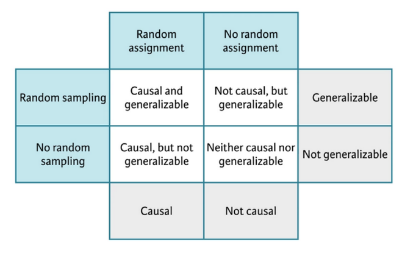

\pagebreak

Models are mathematical tools that can describe a system and capture relationships in the data given to them. They can be used for several purposes...

- **Explore** the data, detect patterns not easy to detect with visualization and simple analysis.

- **Generalize** discoveries in a sample (inference)

- **Find relations between data**, effects between variables.

Models are the result of a prior analysis and data transformation. But there are also a way for enrich our analysis and improve data treatment, as they will simplify mathematically the relations and insights of the existing data.

::: callout-important
# Disclaimer: This is not a machine learning course!

In this course we will do a basic approach to modelling as part of the data analysis process, providing a basic understanding of modelling and how to do a simple data exploration with them.

We won't cover topics related with generalizing results or find effectiveness between variables (causal analysis).

As this is not a machine learning course we will see the basic concepts of modelling but not see them in practice. Just understand how models are build and used inside an exploration work.

Normally modelling is taught inside machine learning, prediction and classification environments.
:::

The different patters discovered by modelling tools can be...

- Association patterns

- Cause-Effect relations

But, these patterns can occur...

- Only on the observed data

- Generalize to the whole population.

## Studies

The way data is collected and treated, will affect how we can generalize the data to the population...

- If we want to generalize the results we will need to use **random sampling**.

And that's not enough sometimes, specially when we speak about scientific studies...

- Use **random assignment**. Establish different treatments as a way to avoid **confusion variables**.

> **Confusion Variable**: *An external variable that can generate the effect on both variables, making a false conclusion of being related.*

::::: columns
::: column
We can see two different studies...

- Based on **observation**. Collect data without any alteration on their generation. Allow us to see **relation**.

- Based on **experimentation**. Applying different treatments to the observations. Allow us to see **effect and cause**.
:::

::: column
{fig-align="center" width="302"}
:::
:::::

## Modelling

Modelling involves different tasks followed by an exploratory data analysis.

This analysis will help us identify the correct model and understand the data for better model improvements.

A modelling project involves different steps, such as EDA, feature engineering (choosing variables), initial modelling, evaluation of models, model engineering and final models implementation.

As we have seen, we will focus in this course to use them for exploration.

{fig-align="center" width="323"}

\pagebreak

# Models {.unnumbered}

```{r, echo=FALSE, message=FALSE, warning=FALSE}
library(tidyverse)
```

## Basic concepts

As we have seen in the introduction models are tools that help us find patterns in the data.

We will study models that relate a group of variables (prediction variables) with a variable we are interested in (answer variable)

Models will represent these relations with **functions**. This functions will map a series of inputs to an output, we can express the function as:

$$y = 3x + 7$$
*Where* $x$ is the input and $y$ the output.

## What are models?

Here you can see an example of a model shown in a plot. That explains the relation between two variables weight of the car (`wt`) and miles per gallon (`mpg`) using the `mtcars` data set.

```{r, echo=TRUE, message=FALSE}
#| code-line-numbers: "6"

library(ggplot2)
ggplot(mtcars, aes(x=wt, y=mpg)) +
  geom_point() +
  theme_minimal() +
  geom_smooth(method="lm", se=FALSE, color="red")
```

## Family of models and models

When we speak about models we need to understand two different things...

- **Family of models** General designed models that define a pattern we want to capture. E.g. the family of linear models that relate $x$ with $y$ is...

$$y = \beta_0 + \beta_1x$$

- **Fitted model** the model inside the family that betters reproduce and captures the existing relation within the data.

Remember models are simplifications of reality, but do not necessary express the reality. They help us summary the patterns and reproduce them.

So when we need to use a model we decide the **family** we want to use. Once selected the family we will apply that model (like a template) to the data we want to explain. The final model that is able to explain the relation will be de **fitted model**.

When we see the structure of a model we need to understand three concepts:

- **Response variable**: Variable we want to analyze and understand, the behavior and variation. It is also known as dependable variable. Normally we will drawn this variable in y axis.

- **Explainable variables**: Variables we want to use to explain the response variable behavior. Also known as independent variables, co-variables, predictors or *features*. We will normally drawn them on the x axis.

- **Predicted variable**: the output of our model for certain value of the explainable variables.

## Fitting models

Look at the following data... do you see any pattern? detect the variables?

```{r, echo=TRUE}
ggplot(mtcars, aes(x=wt, y=mpg)) + 
  geom_point() + theme_minimal()
```

- The data shows a clear pattern.

- We will use a model to try to capture the pattern.

- A linear model seems reasonable: $y = \beta_0 + \beta_1x$

- But linear models is a big family of models, infinite models can exist.

When creating a model we have multiple possibilities...

All possible models, or at least some of them...

```{r, echo=TRUE}
models <- tibble(
a1 = runif(250, -20, 40),
a2 = runif(250, -5, 5)
)

ggplot(mtcars, aes(wt, mpg)) +
  geom_abline(aes(intercept = a1, 
                  slope = a2), 
              data = models, alpha = 1/4) +
  geom_point() + theme_minimal()
```

- As you can see these models are **bad**, didn't capture the pattern.

- We will need to determine which models are **more close** to the data.

One common approximation is to find the model that minimizes the sum of all vertical distances to each point of the straight line of the model.


This is what we know as **Linear Regression**.

\pagebreak

# Linear Regression {.unnumbered}

```{r, echo=FALSE, message=FALSE, warning=FALSE}
library(tidyverse)
```

As we have seen we have used Linear Regression to create a simple model. For obtaining the coefficients of the model formula we do as follows...

```{r, echo=TRUE}
reg_mod <- lm(mpg ~ wt, data = mtcars)

coef(reg_mod)
```

- The first part of the function `mpg ~ wt` is the formula. Equivalent too $mpg = \beta_0 + \beta_1 \cdot wt$

- `coef` function will return the values of both coefficients of the formula. *Intercept* is equal to $\beta_0$ while the second number of equal to $\beta_1$

Linear Regression is an statistical model that explains the linear relation between a predictor $x$ and one quantitative variable $y$ with a certain error $\epsilon$

$$y = \beta_0 + \beta_1x + \epsilon$$

Take into account we won't analyze and see the error $\epsilon$ in this course, but it always exists and is important to analyze it.

## Estimation of Coefficients

- For estimating the values of $\beta_0$ and $\beta_1$ we use the available data.

- The estimations found for each coefficient are the ones that minimize the vertical distance between the values and the model line.

- Each estimation will be known as $b_0$ and $b_1$, making the function $\dot y = b_0 + b_1x$ being $\dot y$ the predicted value

## Model Residuals

Residuals tell us how much far of the real value the predicted one is.

$$Residual = RealValue - PredictedValue = y - \dot y$$ As the linear regression model is the one that minimizes the sum of vertical distances, is the same as telling the one that minimizes the residual sum of squares.

$$\sum_{i=1}^n[y_i - \dot y_i]^2 = \sum_{i=1}^n[y_i - (\beta_0 + \beta_1x)]^2 $$

## Visualizing Models

When speaking about visualization about our models...

- The predictions of our models.
- The residuals of our models.

For doing this we will use `modelr` from `tidyverse`.

First we are going to create a grid of dots of the predicted variable.

```{r, echo=TRUE}
library(modelr)

grid <- mtcars %>% 
  data_grid(wt)

head(grid,6)
```

We can add some predictions...

```{r, echo=TRUE}
# Create the model
reg_mod <- lm(mpg ~ wt, data = mtcars)

# Add the predictions
grid <- grid %>% 
  add_predictions(reg_mod)

head(grid,6)
```

A now we can visualize the model...

```{r, echo=TRUE}
ggplot(mtcars, aes(wt)) +
  geom_point(aes(y = mpg)) + theme_minimal() +
  geom_line(aes(y = pred), data = grid, colour = "red", size = 1)
```

We can now add the residuals....

```{r, echo=TRUE}
mtcars <- mtcars %>% 
  add_residuals(reg_mod)

ggplot(mtcars, aes(wt, resid)) +
  geom_ref_line(h = 0) + geom_point()
```

**To summarise**

- With the **predictions** we can find which pattern we have been able to capture.

- With the **residuals** we can know which pattern has not been captured.

## Using and understanding our models

### What to do with our models?

- **Explain**: explain the relation between $y$ and $x$ with the parameters $\beta_0$ and $\beta_1$

- **Prediction**: for a new value of $x$ and obtain the equivalent value $y$

### Interpreting linear regression

Using the last created model, we can use now `broom` library from tidyverse ecosystem, that offers multiple functions to optimize a create more efficient code and tasks.

```{r, echo=TRUE, message=FALSE}
library(broom)

mod_reg <- lm(mpg ~ wt, data = mtcars)
tidy(mod_reg)
```

#### Intercept

Our linear regression model is...

$$\dot{mpg} = \beta_0 + \beta_1wt$$ $\beta_0$ is the base value in a case of a zero value for $wt$. This will be the predicted value in this case.

Eg. 0 as wt...

$$\dot{mpg} = \beta_0 + \beta_1 * 0 = \beta_0$$

#### Slope

Our linear regression model is...

$$\dot{mpg} = \beta_0 + \beta_1wt$$

$\beta_1$ is the increase we can expect for change in the explainable variable $wt$

Eg. what happens if we increase 1 wt...

$$\beta_0 + \beta_1(wt + 1) = 
\beta_0 + \beta_1wt + \beta_1 = 
\dot{mpg} + \beta_1$$

\pagebreak

::: callout-caution
# Exercise: Experience and Salary

We will see this example where we will try to model the years of experience to the salary of a teacher. In the following cell we are preparing the data sample we are going to work with and make a first visualization of the varibales we want to explain.

```{r, echo=TRUE, message=FALSE}
library(openintro)

# Data preparation
grade <- sample(
  c(rep("elementary", 20), 
    rep("middle", 25),
    rep("high", 26))
)

teacher_sample <- teacher %>% 
  mutate(degree = factor(degree, c("MA", "BA")),
         grade = grade)

# Visualization
ggplot(teacher_sample, 
       aes(x=years, y=base)) +
  geom_point() + theme_minimal()
```

**Part 1.** Fit a linear model, find the coefficients of the formula and interpret them.

**Part 2.** Make a prediction for the salary of teacher with 15 years of experience in the field.
:::

## Categorical Linear Regression

We have started assuming $x$ as a continuous value, but we can find situations where it is categorical.

In this case our normal formula $y = \beta_0 + \beta_1x$ won't fit the scenario as x is not a number. For example if x was a genre: male or female.

What we can do is to create a new variable that has a value of 0 and 1 depending if one category is selected. Let's see it with an example.

We will see it with an example using the same data of the last exercise. Now we are going to analyze the salary depending on the grade...

```{r, echo=TRUE}
# Fiting the model
mod_base_degree <- lm(base ~ degree, data=teacher_sample)
tidy(mod_base_degree)
```

R has created a **indicator variable** degreeBA; if the grade is BA takes value 1 otherwise 0.

In case of more than two variables it will create two or more indicator variables.

Base level is the one that will be assumed by the variable when the rest are 0. We must interpret coefficients respect base level.

So how we can interpret each coefficient...

```{r, echo=TRUE}
# Fiting the model
mod_base_degree <- lm(base ~ degree, data=teacher_sample)
tidy(mod_base_degree)
```

Now we can add the predictions...

```{r, echo=TRUE}
mod_base_degree <- lm(base ~ degree, data=teacher_sample)

grid <- teacher_sample %>% 
  data_grid(degree) %>% 
  add_predictions(mod_base_degree)

grid
```

Visualizing the predictions... what we have predict... average

```{r, echo=TRUE}
ggplot(teacher_sample, aes(x=degree)) + geom_point(aes(y=base)) +
  theme_minimal() +
  geom_point(data = grid, aes(y = pred), colour = "red", size = 4)
```

## Multiple Linear Regression

t is frequent to find scenarios where multiple predictor variables are found. The simplest linear model we can use is the **multiple linear regression**

$$y = \beta_0 + \beta_1x_1 + \beta_2x_2 +  \cdot\cdot\cdot + \beta_nx_n  $$

The effect of each variable can be analyzed independently of the rest of variables.

We are going to explain it with the same example, now combining both Degree and Experience to explain the Salary...

```{r, echo=TRUE}
mod_reg <- lm(base ~ years + degree, data = teacher_sample)

tidy(mod_reg)
```

Adding the predictions

```{r, echo=TRUE}
grid <- teacher_sample %>% 
  data_grid(years, degree) %>% 
  add_predictions(mod_reg)

grid
```

Visualizing the model and the predictions...

```{r, echo=TRUE}
ggplot(teacher_sample, aes(years, base, colour = degree)) +
  geom_point() +
  geom_line(data = grid, aes(y = pred)) + theme_minimal()
```

\pagebreak

# Inference {.unnumbered}

```{r, echo=FALSE, message=FALSE, warning=FALSE}
library(tidyverse)
```

We need to understand some concepts first...

- **Population**: Group of elements to study
- **Parameter**: Numeric amount originated from the population, normally unknown.

If we have data about each element of the **population** we could calculate the population **parameter**.

But this is not possible in most of the cases. For this reason we work with...

- **Sample**: A subset of our population of interest.
- **Statistic**: Numeric amount originated from the sample.

If the **sample** represents correctly the population we could use probability and statistical inference to obtain conclusions applicable to the whole population.

## Statistical Inference

**Statistical Inference** is the process that allows, through data, obtain conclusions and apply them to the whole population where the sample was originated.

- **Estimation**, use the sample to estimate a possible interval of values for a given population parameter unknown.

- **Hypothesis Contrast**, evaluate if the given sample shows an evidence of the application of a given affirmation about the population.

We will work with **estimation** here.

For the rest of this chapter we will work with a sample data to help us explain the concepts and a case: **Average price of an Airbnb in València**

We have obtained the data from València Airbnb prices thanks to [Inside Airbnb](https://insideairbnb.com/valencia/) data repository that scrapped all listings from the website on the 22nd of June 2024.

**Population for the analysis:** All airbnb' houses/apartments with at least 10 reviews in València.

**Goal Paremeter:** Average price per night in those airbnbs.

Which is the average price for an airbnb with at leat 8 reviews in the city of Valéncia at the month of June?

We are going to use a random sample data with 50 airbnb locations with the price per night value informed.

## Point Estimation

A **point estimator** is a value computed from the sample to serve as the "best estimation" for the population parameter.

Our point estimator for the average price per night will be the average obtained from the sample:

```{r, echo=TRUE, message=FALSE}
data <- read_csv("../data/vlc_listings_50.csv")
data %>% 
  summarise(mean_price = mean(price))
```

Now we can see our point estimator and the sample represented with an histogram

```{r}
ggplot(data) +
  geom_histogram(aes(x=price),bins=10,fill="lightgrey",color="black") +
  geom_vline(xintercept = 137.98, color="red") +
  geom_text(x=150, y = 15, label = "137.9", size = 4) +
  ggtitle("AirBnB price distribution for June 2024 in València") +
  theme_minimal()
```

Point estimators are useful when we are trying to find a general value to define a parameter, but they can be not representative and highly affected by the distribution of the sample values. We can provide a range of values where the parameter can be found.

- If we provide only a single value (point estimation), we can fail trying to find the exact parameter for the population.

- If we provide a range of values, we have more probabilities of having the parameter inside the range of values we found.

## Confidence Intervals

For building a confidence interval for the population parameter, we need to create a rank of possible values around the observed sample's average.

It is important to note that the random samples, will be different between them. This means if we take a another random sample of more 50 listings about AirBnb in València, it is possible not to obtain the same price average.

**There is a variability in the sample average.**

For building a confidence interval, we need to measure this variability. This will give us on how much we can expect our sample average to variate from each sample.

::: callout-caution
# Practice

**Ex 1:** We divide the class in two groups and we ask each student their height. Then we compute the average height for each group. Will you expect them to be the same, similar or different?

**Ex 2:** We take 50 students randomly and looks 5 of them write with the left hand. If you take another random sample of 50 students. How many of them will you expect to be left-handed? Will you be surprised if only 3 of them are left-handed? And if they were 40 this time?
:::

### How to measure variability?

We can measure variability of the sample values with different approaches:

- **Simulation**: we can use re-sampling techniques or "bootstrap" to find different values for the same metric.

- **Theory**: using the Central Limit Theorem (Normal Distribution)

## Bootstrap

**Bootstrap** is a re-sample technique used for measuring the variance of an estimation.

We will use it for estimating the population parameter using only the given sample.

It uses the same principles of the statistical inference so it is considered an alternative.


### Bootstrap Procedure

1.  Take a **bootstrap sample**, a random sample **with replacement** from the original sample, **with the same size** of the original sample.

2.  Compute the **bootstrap statistic**: the statistic we want to compute (average, median, correlation, ...) using the bootstrap sample.

3.  Repeat steps 1 and 2 multiple times to create a **bootstrap distribution** - a distribution of bootstrap statistics.

4.  Compute the confidence interval limits of XX% as the region that has the XX% of the bootstrap distribution.

#### Step by step

**Step 1.** Take a **bootstrap sample**, a random sample **with replacement** from the original sample, **with the same size** of the original sample.

```{r, message=FALSE}
set.seed(1)
indices <- sample(1:nrow(data), 50, replace = T)
boot_samp_1 <- data %>% 
  select(price) %>% 
  slice(indices)
```

```{r, message=FALSE}
ggplot(boot_samp_1) +
  geom_histogram(aes(x=price),bins=10,fill="lightgrey",color="black") +
  theme_minimal()

```

**Step 2.** Compute the **bootstrap statistic**: the statistic we want to compute (the average price in this case) using the bootstrap sample.

```{r}
mean1 <- round(mean(boot_samp_1$price), 2)
ggplot(boot_samp_1) +
  geom_histogram(aes(x=price),bins=10,fill="lightgrey",color="black") +
  geom_vline(xintercept = mean1, color="red") +
  geom_text(x=150, y = 15, label = mean1, size = 4) +
  theme_minimal()

```

**Step 3.** Repeat steps 1 and 2 multiple times to create a **bootstrap distribution**

```{r, echo = F, message=FALSE}
set.seed(1)
temp <- data %>% slice(sample(1:50, replace = T))
mean1 <- round(mean(temp$price), 2)
p1 <- ggplot(temp) +
  geom_histogram(aes(x=price),bins=10,fill="lightgrey",color="black") +
  geom_vline(xintercept = mean1, color="red") +
  geom_text(x=150, y = 15, label = mean1, size = 4) +
  theme_minimal()
```

```{r, echo = F, message=FALSE}
set.seed(2)
temp <- data %>% slice(sample(1:50, replace = T))
mean1 <- round(mean(temp$price), 2)
p2 <- ggplot(temp) +
  geom_histogram(aes(x=price),bins=10,fill="lightgrey",color="black") +
  geom_vline(xintercept = mean1, color="red") +
  geom_text(x=150, y = 15, label = mean1, size = 4) +
  theme_minimal()
```

```{r, echo = F, message=FALSE}
set.seed(3)
temp <- data %>% slice(sample(1:50, replace = T))
mean1 <- round(mean(temp$price), 2)
p3 <- ggplot(temp) +
  geom_histogram(aes(x=price),bins=10,fill="lightgrey",color="black") +
  geom_vline(xintercept = mean1, color="red") +
  geom_text(x=150, y = 15, label = mean1, size = 4) +
  theme_minimal()
```

```{r, echo = F, message=FALSE}
set.seed(4)
temp <- data %>% slice(sample(1:50, replace = T))
mean1 <- round(mean(temp$price), 2)
p4 <- ggplot(temp) +
  geom_histogram(aes(x=price),bins=10,fill="lightgrey",color="black") +
  geom_vline(xintercept = mean1, color="red") +
  geom_text(x=150, y = 15, label = mean1, size = 4) +
  theme_minimal()
```

```{r, echo=F, message=FALSE}
 ggpubr::ggarrange(p1, p2, p3, p4)
```

In this case we have make 500 bootstrap re-samples and then compute the average for each one. What we do finally is represent all the averages in an histogram plot:

```{r, echo = F, out.width = "70%", message=FALSE, warning=FALSE}
boot_dist <- tibble(boot_mean = numeric(500))
for(i in 1:500){
  set.seed(i)
  indices <- sample(1:50, replace = T)
  boot_dist$boot_mean[i] <- mean(data$price[indices])
}
ggplot(data = boot_dist, aes(boot_mean)) +
  geom_histogram(binwidth = 5, color = "darkred", fill = "pink") +
  labs(x = "", y = "", title = "Bootstrap distribution of sample means") +
  scale_x_continuous(breaks = seq(0, 250, by = 50)) + 
  xlim(0, 250) +
  theme_minimal()
```

Here we can compare the original sample and the distribution of bootstrap means.

```{r, echo=F, message=FALSE, warning=FALSE}
p1 <- ggplot(data) +
  geom_histogram(aes(x=price),bins=10,fill="lightgrey",color="black") +
  geom_vline(xintercept = 137.98, color="red") +
  geom_text(x=150, y = 15, label = "137.9", size = 4)+
  ggtitle("Original Sample") +
  scale_x_continuous(breaks = seq(0, 450, by = 50)) + 
  xlim(0, 450) +
  theme_minimal()
```

```{r, message=FALSE, warning=FALSE}
#| echo: false

boot_dist <- data.frame(boot_mean = numeric(500))
for(i in 1:500){
  set.seed(i)
  indices <- sample(1:50, replace = T)
  boot_dist$boot_mean[i] <- mean(data$price[indices])
}

p2 <- ggplot(data = boot_dist, aes(boot_mean)) +
  geom_histogram(binwidth = 5, color = "darkred", fill = "pink") +
  labs(x = "", y = "", title = "Bootstrap distribution of sample means") +
  scale_x_continuous(breaks = seq(0, 450, by = 50)) + 
  xlim(0, 450) +
  theme_minimal()
```

```{r, echo=FALSE, message=FALSE, warning=FALSE}
 ggpubr::ggarrange(p1, p2, ncol=1, nrow=2)
```

**Step 4.** Compute the limits of the bootstrap interval using the percentiles of the bootstrap distribution.

Imagine we want a confidence of 95%:

```{r, message=FALSE}
# Intervals
lowerBound = quantile(boot_dist$boot_mean,(1-95/100)/2)
upperBound = quantile(boot_dist$boot_mean,95/100+(1-95/100)/2)

print(paste("Lower Bound:", lowerBound))
print(paste("Upper Bound:", upperBound))
```


## `infer` package

Infer package help us do an inferential analysis like bootstraping but using the tidyverse ecosystem sintax.

```{r,echo=T, message=FALSE}
library(infer)
```

### Choose a seed

```{r, echo=T, message=FALSE}
set.seed(123)
```

When doing analysis, simulations and sampling techniques it is recommended to make them replicable.

`set.seed()` is an R base function that help us establish a common starting point on your machine, helping you control simulations and making them replicable.

This means that if use the same seed, you will guarantee that each time you run your code you will get the same results.

### Generate Bootstrap averages

#### `specify()`

```{r, echo=T, eval=F, message=FALSE}
#| code-line-numbers: "2,3"
data %>% 
  # specifiy the variable of interest
  specify(response = price)
```

With `specify()`, we will tell infer which is the variable we will use to make the re-sampling, our objective variable to obtain the bootstrap mean.

#### `generate()`

```{r, echo=T, eval=F}
#| code-line-numbers: "4,5"
data %>% 
  # specifiy the variable of interest
  specify(response = price) %>% 
  # generate 15000 bootstrap samples
  generate(reps = 1500, type = "bootstrap")
```

With `generate()`, we will tell infer which is the number of re-samplings we want to do, and the technique we want to use. In this case Bootstrap re-sampling.

#### `calculate()`

```{r, echo=T, eval=F}
#| code-line-numbers: "6,7"
data %>% 
  # specifiy the variable of interest
  specify(response = price) %>% 
  # generate 15000 bootstrap samples
  generate(reps = 1500, type = "bootstrap") %>% 
    # calculate the statistic of each bootstrap sample
  calculate(stat = "mean")
```

With `calculate()`, we will tell infer which is the metric we want to compute for each sample, so we can get the metric distribution. In this case we choose the mean, but we can select other kind of metrics, like the median for example.

\pagebreak

::: callout-caution
# Full Example of Bootstrap computation

```{r, echo=T, message=FALSE}

num_reps <- 100

# save resulting bootstrap distribution
boot_dist <- data %>%
  # specify the variable of interest
  specify(response = price) %>% 
  # generate 100 bootstrap samples
  generate(reps = num_reps, type = "bootstrap") %>% 
  # calculate the statistic of each bootstrap sample
  calculate(stat = "mean")

boot_dist %>% glimpse()
```
:::

## Visualize the distribution

```{r, message=FALSE, warning=FALSE}
ggplot(data = boot_dist, aes(stat)) +
  geom_histogram(binwidth = 5, color = "darkred", fill = "pink") +
  labs(x = "", y = "", title = "Bootstrap distribution of sample means") +
  scale_x_continuous(breaks = seq(0, 250, by = 50)) + 
  xlim(0, 250) +
  theme_minimal()
```

## Computing Confidence Intervals

A confidence interval of 95% means that it contains the 95% central possible values of the bootstrap distribution. For obtaining this 95%, we need to exclude the other 5% of the sample.

As it is a 95% central, means that we need to exclude 2.5% of each side (5% / 2) of the distribution.


For making this computation with **dplyr**:

```{r, echo=T, message=FALSE}
ci <- boot_dist %>%
  summarise(lower_b = quantile(stat, 0.025), 
            upper_b = quantile(stat, 0.975))
ci
```

## Visualizing Confidence Intervals

### Option 1

Using ggplot geometric `geom_vline()` to mark the limits of the interval:

```{r, message=FALSE, warning=FALSE}
#| code-line-numbers: "1,3,4,5,6"
ggplot(data = boot_dist, mapping = aes(x = stat)) +
  geom_histogram(binwidth = 5, alpha = .5) +
  geom_vline(xintercept = ci$lower_b,
             color = "steelblue", lty = 2, size = 1) + 
  geom_vline(xintercept = ci$upper_b,
             color = "steelblue", lty = 2, size = 1) +
  labs(title = "Bootstrap distribution of the average price.",
       subtitle = "with CI of 95%",
       x = "Averages", y = "Number") +
  theme_minimal()
```

### Option 2

Using `visualize` function together with `shade_confidence_interval` that prints the intervals passed.

```{r, message=FALSE, warning=FALSE}
#| code-line-numbers: "1,2"
visualize(boot_dist) +
  shade_confidence_interval(endpoints = ci)+
  labs(title = "Bootstrap distribution of the average price.",
       subtitle = "with CI of 95%",
       x = "Averages", y = "Number") +
  theme_minimal()
```

## Interpreting the Confidence Interval

Our Confidence Interval of 95% is \[122, 158\].

- The population parameter can be or not in our interval. There is no a "probability of 95%" for it to be in an specific interval.

- Bootstrap distribution computes the variance of the parameter based on sample of the population. And the idea that the origin data comes from a sample, means that if if we change the sample the interval with a confidence of 95% can change.

- All that we can say, is that \*if we take independent samples of the population and compute a 95% CI for the average for each one, we expect that the 95% of these intervals to contain the population average.

- But we are not sure enough that the population parameter is inside the interval.

|  |
|----|
| **We have a 95% confidence that the average price of an apartment in València for June is between 122 and 158 euros.** |
